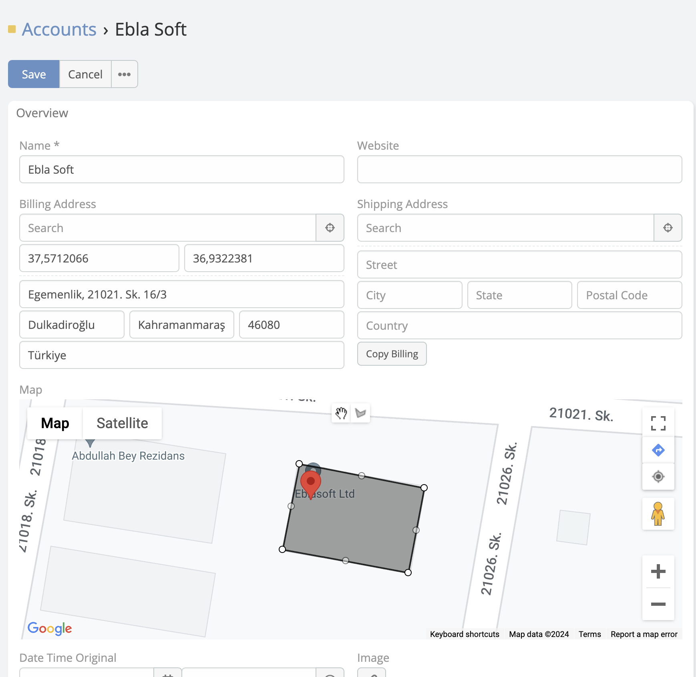
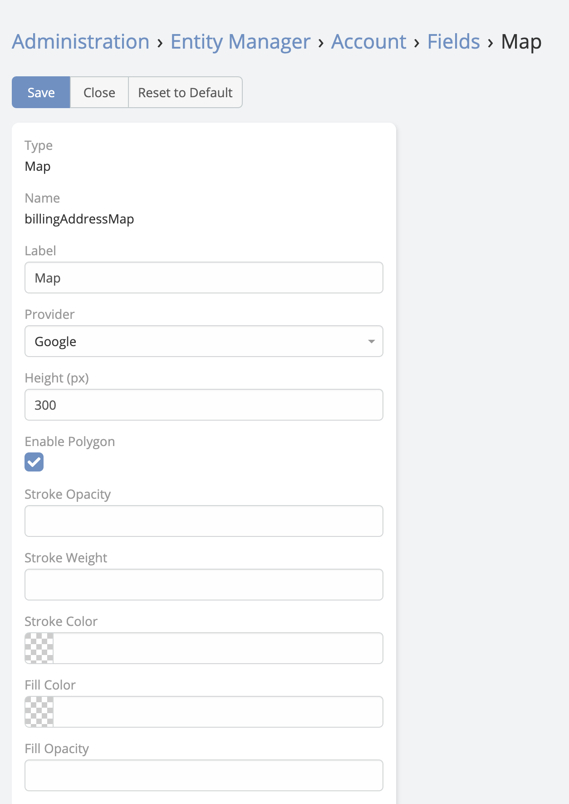

# Polygon Map

The **Polygon Map** field type lets users draw, edit, and store polygon shapes directly on an EspoCRM record. The field stores polygon data as JSON and supports configurable default center coordinates, search, and fill or stroke styling.



---

## Field Parameters

In addition to standard field options such as read-only or audited, Polygon Map supports these map-specific parameters:

| Parameter | Description |
| --- | --- |
| `mapCenter` | Default center of the map in the format `latitude|longitude`, for example `40.40|34.50`. |
| `enableSearch` | Shows a Google Places search box so users can move the map to a searched place before drawing. |
| `strokeColor` | Polygon border color. |
| `fillColor` | Polygon fill color. |
| `strokeOpacity` | Polygon border opacity. |
| `fillOpacity` | Polygon fill opacity. |
| `strokeWeight` | Polygon border width in pixels. |

---

## User Actions

In edit mode, users can:

- Search for a place and recenter the map
- Use the current-location button to move the map to the user's position
- Draw polygons directly on the map
- Drag polygons after drawing them
- Remove vertices with right-click

When no polygon exists yet, the map centers on `mapCenter` and shows a marker at that starting point.

---

## Stored Data Format

The field stores polygon data in JSON format like this:

```json
{
  "polygons": [
    [
      {"lat": 40.1, "lng": 29.9},
      {"lat": 40.2, "lng": 29.8}
    ]
  ]
}
```

This structure can be used later in exports, custom logic, or integrations.

---

## Adding a Polygon Map Field

1. Navigate to **Administration** -> **Entity Manager**.
2. Open the target entity.
3. Click **Fields** -> **Add Field**.
4. Set **Type** to **Polygon Map**.
5. Configure the field parameters.
6. Save the field and add it to the layout.



---

## See Also

- [Map Route](map-route.md)
- [Map View](map-view.md)
