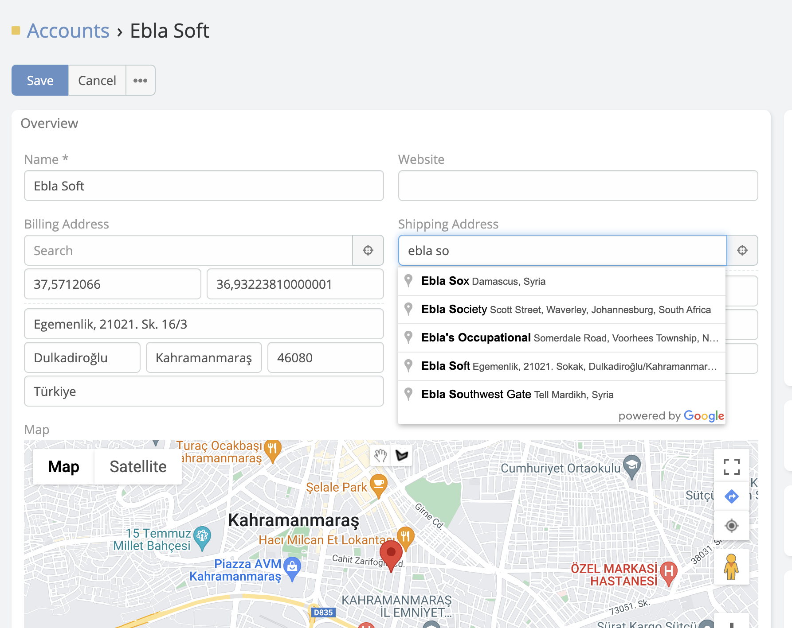

# Search Place Autocomplete

> The existing field of type **Address** in EspoCRM now includes a search ability
> using [Google Places API](https://developers.google.com/maps/documentation/places/web-service/overview). Users can
> search for an address, and the field will populate with the selected result, filling in all the address data
> automatically.
> Search Place Autocomplete is available in [Ebla Map Plus](https://www.eblasoft.com.tr/espocrm-extension-page/espocrm-map-extension).

 

