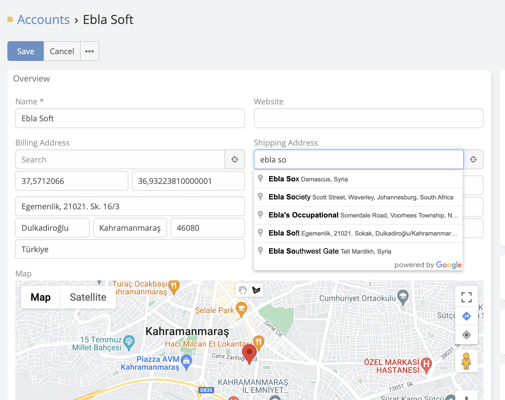
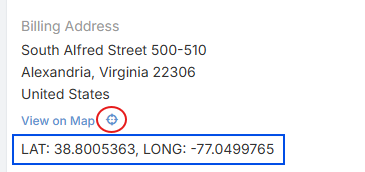
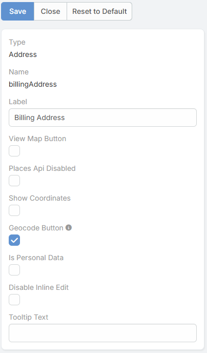
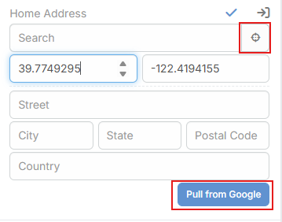
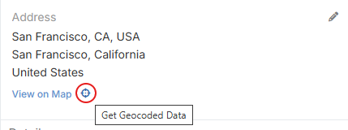

# Place Search Autocomplete

Address fields in EspoCRM gain a Google Places-powered search input. Start typing a place name or street address, select a suggestion, and the extension fills the address components automatically while also storing coordinates and place data.

---

## Prerequisites

- Ebla Map Plus installed with a valid Google Maps API key.
- **Maps JavaScript API** and **Places API** enabled in Google Cloud.
- The address field must not have **Places API Disabled** enabled.

---

## What Gets Filled Automatically

When a user selects a Google Places suggestion, the extension can populate:

- Street
- City
- State / Province
- Country
- Postal Code
- Latitude
- Longitude
- Address `data` JSON with Google place details
- `geocodeType` as exact place data from the Places response

---

## How It Works

1. Open any record in edit mode.
2. Focus the address field and use the search bar shown above the address inputs.
3. Type a place name, street, or establishment.
4. Select a suggestion from Google Places.
5. Review the populated values and save the record.

The extension can also use the browser's geolocation API through the location button to detect the user's current position and reverse-fill the address field.

---

## Address Field Parameters

The enhanced address field includes these extension-specific parameters:

| Parameter             | Description |
|-----------------------| --- |
| `Places Api Disabled` | Disables the autocomplete and Google Places enhancements for that address field. |
| `Show Coordinates`    | Shows the latitude and longitude inputs directly in the address editor and in read mode. |
| `Geocode Button`      | Adds a manual geocode button in read mode so users can fetch or refresh geocoded data for that address. |

---

## Google Maps Integration Settings

These global integration options directly affect autocomplete behavior:

| Setting                             | Description |
|-------------------------------------| --- |
| `Language`                          | Forces the response language for Places and other Google requests. |
| `Autocomplete Restricted Countries` | Limits autocomplete results to specific ISO country codes. |
| `Country Name`                      | Stores country values in short or long format. |
| `State Name`                        | Stores state values in short or long format. |
| `City Name`                         | Stores city values in short or long format. |
| `Restrict Country Selection`        | Validates the selected country against the configured country restriction list. |

---

## Restricting Autocomplete by Country

To limit suggestions to specific countries:

1. Navigate to **Administration** -> **Integrations** -> **Google Maps**.
2. Set **Autocomplete Restricted Countries** to the ISO 3166-1 alpha-2 country codes you want to allow, for example `tr`, `us`, or `de`.
3. Save.

If **Restrict Country Selection** is enabled, users can only save country values that belong to this allowed list.

---

## Additional Address Actions

- **Locate Current Position**: This action uses the browser’s geolocation feature to detect the user’s current physical location. It retrieves the device’s latitude and longitude, saves them in the address field, and then sends them to Google Maps for reverse geocoding. Google returns the related address details, such as street, city, state, country, and postal code. This makes it easy to create an address directly from the user’s real-time location instead of entering it manually, which is especially useful for mobile users, field teams, and on-site activities.
- **Pull from Google**: This action is used when the record already contains saved coordinates. It sends the stored latitude and longitude to Google Maps and asks for the address linked to that location. The returned values are then written back into the address field, updating details like street, city, state, country, and postal code. This is helpful when the coordinates are correct but the text address is missing, inconsistent, outdated, or needs to be standardized.
- **Get Geocoded Data**: manually refreshes an address field’s map data from Google. It updates values such as latitude, longitude, geocode data, and geocode type, and asks for confirmation before replacing existing coordinates. This is useful when map data is missing, outdated, or needs to be corrected without waiting for automatic geocoding.

## See Also

- [Latitude and Longitude (Geocoding)](latitude-and-longitude.md)
- [Map View](map-view.md)
- [Select on Map](select-on-map.md)
