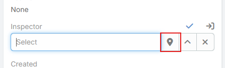
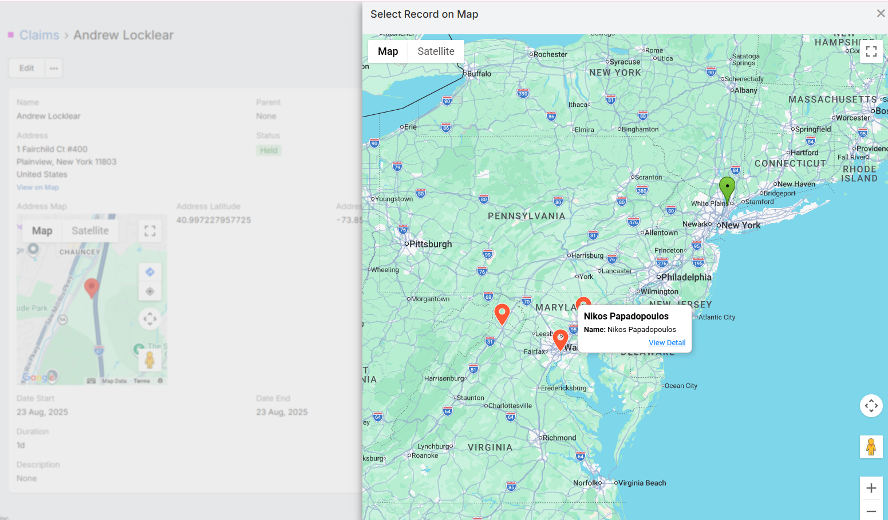
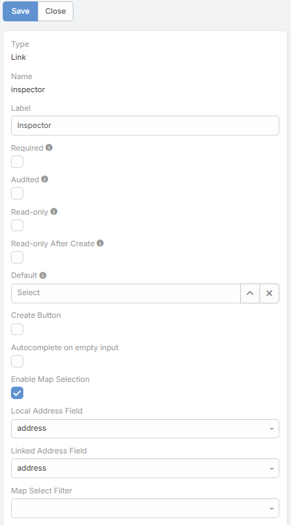

# Select on Map

**Select on Map** extends standard EspoCRM **link** fields with a map button in edit mode. Instead of opening only the standard record picker, users can choose a related record visually from a map based on the current record's address.

This is useful for assigning the nearest branch, location, warehouse, partner, or parent record.

---

<iframe width="650" height="315" src="https://www.youtube.com/embed/RTkjNLVZrZY" frameborder="0" allow="accelerometer; autoplay; clipboard-write; encrypted-media; gyroscope; picture-in-picture" allowfullscreen></iframe>

---

---

## Supported Field Parameters

The feature adds these parameters to link fields:

| Parameter              | Description |
|------------------------| --- |
| `Enable Map Selection` | Enables the **Select on Map** button for the link field. |
| `Local Address Field`  | Address field on the current entity used as the map origin. |
| `Linked Address Field` | Address field on the linked entity used to place candidate records on the map. |
| `Map Select Filter`    | Optional preset filter applied to the linked entity collection before rendering the map. |

When **Enable Map Selection** is turned on, the other three parameters become visible in the field editor.

---

## How It Works

1. The user opens a record in edit mode.
2. The link field shows a map-marker button.
3. Clicking it opens a map modal centered on the current record's `Local Address Field` coordinates.
4. Records from the linked entity are plotted using `Linked Address Field`.
5. The user selects a record from the map and the link field is filled automatically.

If the current record does not have latitude and longitude on the chosen local address field, the map selector cannot open.

---

## Map Modal Behavior

The map selection modal includes several behaviors that are not available in the standard link picker:

- It can load up to 1000 records from the linked scope.
- It places the current record on the map as the origin marker.
- It clusters linked records on the map.
- It can show distance and duration overlays from the origin to nearby visible records.
- Clicking a marker opens a detail modal where the user can review the record, select it, or open it in a new tab.

Distance display follows the global **Measurement Format** option in the Google Maps integration.

---

## Typical Use Cases

- Select the nearest **Location** record for a customer.
- Choose the correct **parent** or linked branch based on proximity.
- Assign the closest service center, delivery point, or technician record.

---

## See Also

- [Map View](map-view.md)
- [Latitude and Longitude (Geocoding)](latitude-and-longitude.md)
- [Map Route](map-route.md)
