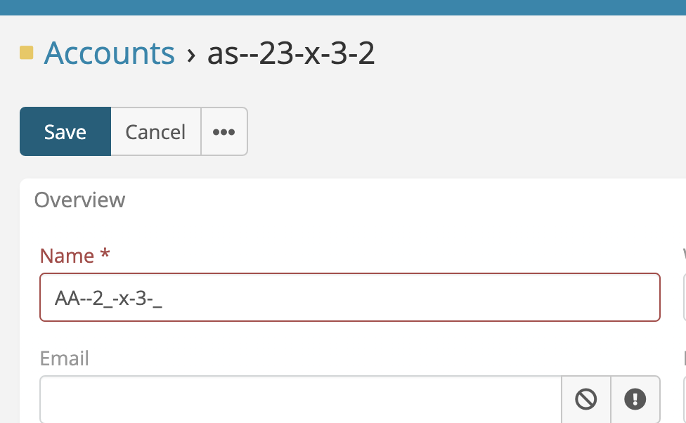
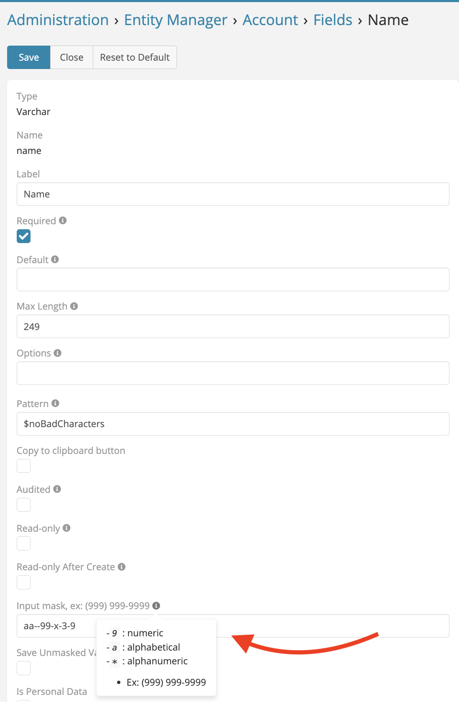

# Mask Field 

> Set an input mask for any existing **Varchar** field (including phone-like values) and keep entered data consistent.
> Available here: [Ebla Mask Field](https://www.eblasoft.com.tr/espocrm-extension-page/espocrm-mask-field).

## Overview
**Ebla Mask Field** lets administrators define input masks for Varchar fields in EspoCRM. Masks guide users while typing, prevent incomplete values from being saved, and keep data entry consistent.

## Features
* **Input Masking**: Define a custom mask for any Varchar field.
* **Validation**: Saving is blocked when a masked value is incomplete.
* **Storage Mode**: Choose between masked storage (formatted) and unmasked storage (raw characters).
* **Display Formatting**: Raw values can still be displayed in masked format for readability.

---
## Quick Setup
To apply a mask on a field:

1. Go to **Administration > Entity Manager**.
2. Open the entity (for example, Contact or Account).
3. Edit an existing **Varchar** field (or create a new one).
4. Configure:
   * **Mask**: The input pattern.
   * **Save Unmasked Value**:
      * Enabled: store raw characters only.
      * Disabled: store the formatted value.
5. Save the field and test by creating or editing a record.

### Mask Syntax
Supported mask tokens:
* `9`: Numeric (`0-9`)
* `a`: Alphabetic (`a-z`, `A-Z`)
* `*`: Alphanumeric (`0-9`, `a-z`, `A-Z`)

Examples:
* Phone: `(999) 999-9999`
* Date: `99/99/9999`
* License Plate: `99-aaa-99`

## Behavior Notes
* When a field has a mask and contains a value, the extension checks whether the mask is complete before save.
* Validation message shown to users: `"{field}: mask is incomplete."`
* If **Save Unmasked Value** is enabled, the database stores raw characters; display can still be formatted by the mask.

## Troubleshooting
* If a value cannot be saved, verify all required mask characters are filled.
* If formatting looks unexpected, re-check mask tokens (`9`, `a`, `*`) and static separators.
* After metadata-related changes, rebuild EspoCRM cache/metadata.

## License
This extension is the property of Eblasoft Bilişim Ltd. It is not freeware and requires a valid license for use. See the included LICENSE file for full terms.

---

## ChangeLog

