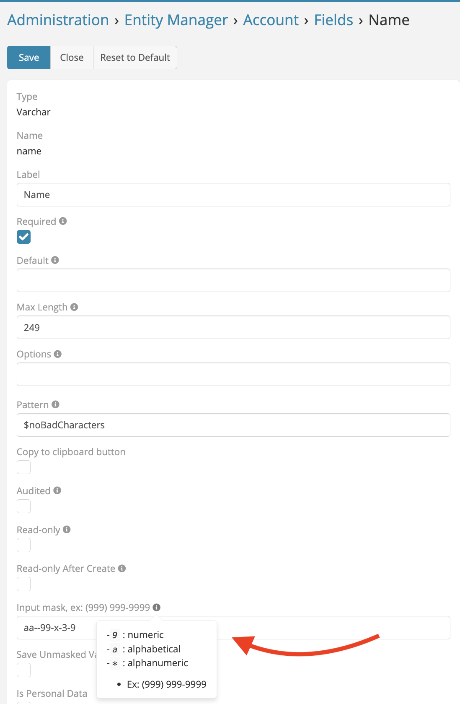

# Mask Field 

> Ability set mask input for any existing varchar field (Phone & Varchar) in addition to the new fields in EspoCRM.
> is available in [Ebla Mask Field](https://www.eblasoft.com.tr/espocrm-extension-page/espocrm-mask-field).

---

<iframe width="650" height="315" src="https://www.youtube.com/embed/q1HM6IPTw_w" frameborder="0" allow="accelerometer; autoplay; clipboard-write; encrypted-media; gyroscope; picture-in-picture" allowfullscreen></iframe>

 

###  [ChangeLog](changelog.md) 

---

**-** Go to **Administration** -> **Entity Manager** -> **{Entity Type}** -> **Fields(Varchar & Phone)**.

 

###  [ChangeLog](changelog.md) 