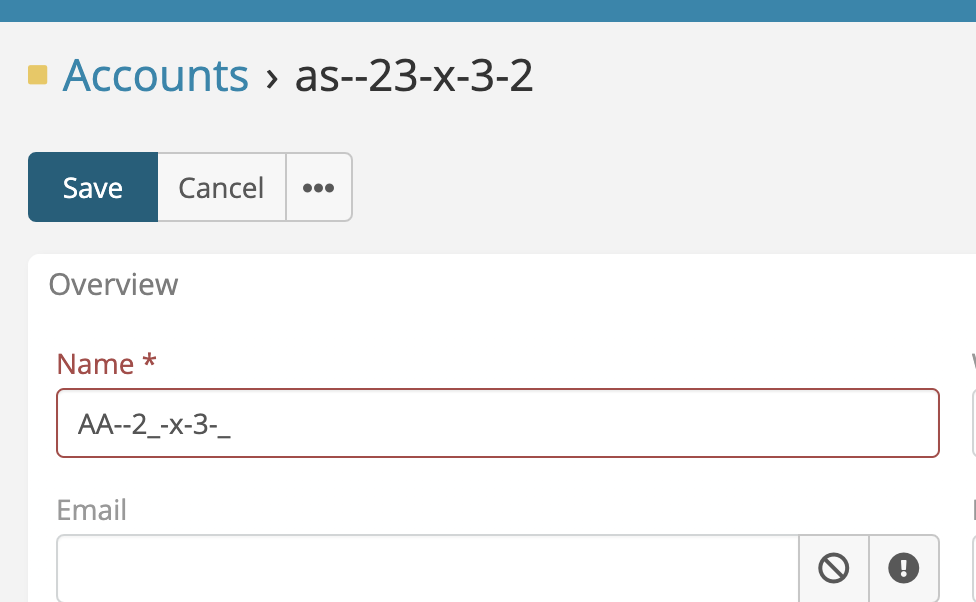

# Mask Field 

> Ability set mask input for any existing varchar field (Phone & Varchar) in addition to the new fields in EspoCRM.
> is available in [Ebla Mask Field](https://www.eblasoft.com.tr/espocrm-extension-page/espocrm-mask-field).

## Overview
The **Ebla Mask Field** extension for EspoCRM allows administrators to define input masks for Varchar fields. This ensures data consistency by enforcing specific formats (e.g., phone numbers, postal codes, license plates) during data entry.

## Features
*   **Input Masking**: Define custom masks for any Varchar field.
*   **Data Validation**: Prevents saving the record if the input does not match the required mask format.
*   **Storage Control**: Choose whether to save the value with the mask characters (e.g., `(123) 456-7890`) or just the raw data (e.g., `1234567890`).
*   **Display Formatting**: Automatically formats values in Detail and List views according to the configured mask.

---
## Usage
To apply a mask to a field:

1.  Navigate to **Administration > Entity Manager**.
2.  Select the desired entity (e.g., Contact, Account).
3.  Click on **Fields** and edit an existing **Varchar** field or create a new one.
4.  You will see two new parameters:
    *   **Mask**: Enter the mask pattern here.
    *   **Save Unmasked Value**: Check this box to save only the raw input (removing formatting characters) to the database. Uncheck it to save the formatted string.
5.  Save the field.

### Mask Syntax
The extension supports standard input mask definitions:
*   `9`: Numeric (0-9)
*   `a`: Alphabetical (a-z, A-Z)
*   `*`: Alphanumeric (0-9, a-z, A-Z)

**Examples:**
*   Phone Number: `(999) 999-9999`
*   Date: `99/99/9999`
*   License Plate: `99-aaa-99`

## License
This extension is the property of Eblasoft Bilişim Ltd. It is not freeware and requires a valid license for use. See the included LICENSE file for full terms.

---

## ChangeLog

