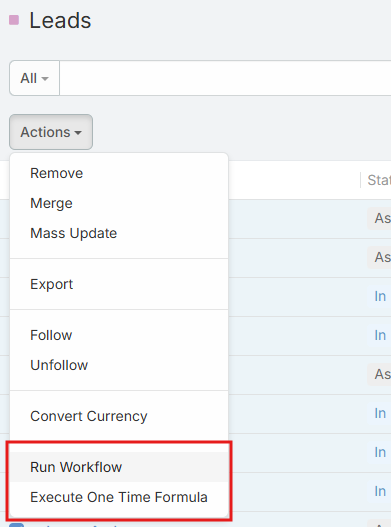
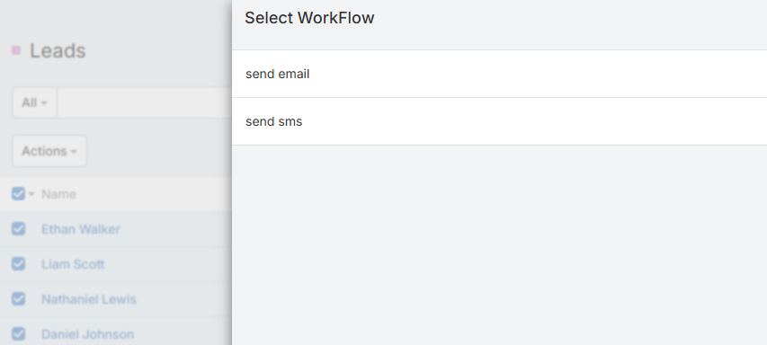
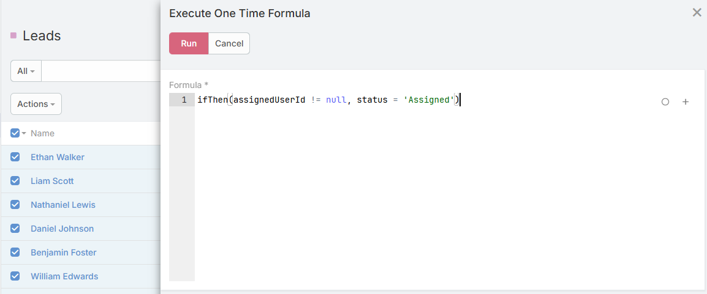

# Ebla Mass Action <a href="https://www.eblasoft.com.tr/espocrm-extension-page/ebla-mass-action" target="_blank" id="ext-version" data-id=""></a>

> Add two powerful mass actions to EspoCRM lists that allow executing workflows or formulas on multiple selected records in a single click.  
> Available in [Ebla Mass Action](https://www.eblasoft.com.tr/espocrm-extension-page/ebla-mass-action).

---

## Overview
**Ebla Mass Action** extension enhances EspoCRM list views by adding advanced bulk actions that save time and reduce manual work.

It allows administrators and users to:

- Run manual workflows on many records simultaneously.
- Execute a one-time formula on multiple records without creating permanent automation.

This extension is ideal for data updates, mass corrections, bulk assignments, and quick operational tasks.


---

## Mass Actions

### 1. Run Workflow
Adds a new mass action called **Run Workflow** in list views.

**How it works:**
1. Select multiple records from a list.
2. Open the **Mass Action** menu.
3. Click **Run Workflow**.
4. A modal window opens displaying all **Manual Workflows** available for the current entity.
5. Choose a workflow.
6. The selected workflow will be executed on all selected records.

**Use cases:**
- Change status for many records.
- Send notifications.
- Update multiple fields using workflow logic.
- Trigger integrations.

> ⚠️ This mass action requires the **Advanced Pack**.


---

### 2. Execute One Time Formula
Adds a new mass action called **Execute One Time Formula**.

**How it works:**
1. Select multiple records from a list.
2. Open the **Mass Action** menu.
3. Click **Execute One Time Formula**.
4. A modal window opens with a Formula input field.
5. Enter a formula expression.
6. The formula is executed once on every selected record.

**Example:**
```text
ifThen(assignedUserId != null, status = 'Assigned')

```
