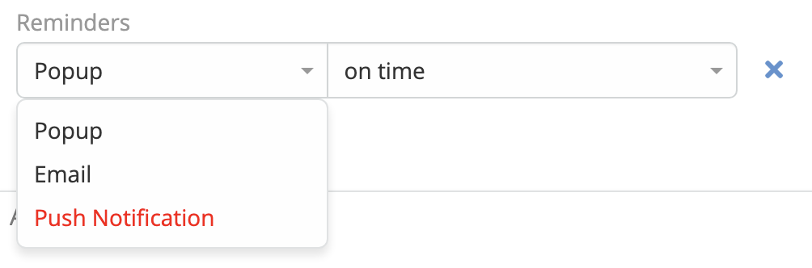

# Mobile App 

> With this module, you can now enable EspoCRM mobile and desktop applications using PWA (Progressive Web App)
> technology, allowing for seamless integration and access to your CRM on-the-go.
> With the added benefit of push notifications, you can stay updated on important activities, leads, and opportunities
> in real-time, ensuring that you never miss a beat.
> Push Notifications and Telegram integration.
> This module available
> in [Ebla Mobile App](https://www.eblasoft.com.tr/espocrm-extension-page/espocrm-mobile-app-push-notifications-pwa).

 

<iframe width="750" height="350" src="https://www.youtube.com/embed/XVqPDNeLLUw" frameborder="0" allow="accelerometer; autoplay; clipboard-write; encrypted-media; gyroscope; picture-in-picture" allowfullscreen></iframe>

 

---

### Features:

- [Progressive Web App (PWA)](pwa.md)
- [Push Notifications](providers/webpush/overview.md)
- [Telegram Notifications (using bot)](providers/telegram/overview.md)
- [Support push notifications for reminders](#support-push-notifications-for-reminders)

 

#### Providers

- [WebPush ](providers/webpush/overview.md)
- [Telegram](providers/telegram/overview.md)
- Whatsapp (Coming Soon)
- Slack (Coming Soon)
- Rocket.Chat (Coming Soon)

 

#### Support push notifications for reminders

###  [ChangeLog](changelog.md) 
