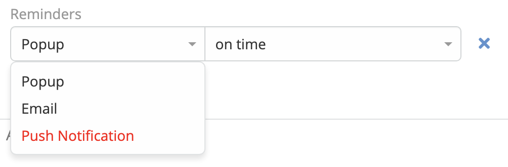

# Mobile App 

## Overview

**Ebla Mobile App** adds three major capabilities to EspoCRM:

- an installable **Progressive Web App (PWA)** experience for mobile and desktop browsers,
- **push notifications** through **WebPush**,
- **Telegram notifications** through a Telegram bot integration.

The extension is designed so that administrators define the global defaults in **Administration** → **Mobile App**, while each user can fine-tune delivery behavior in **Notification Preferences**.

<iframe width="750" height="350" src="https://www.youtube.com/embed/XVqPDNeLLUw" frameborder="0" allow="accelerometer; autoplay; clipboard-write; encrypted-media; gyroscope; picture-in-picture" allowfullscreen></iframe>

---

## What the extension covers

### PWA experience

- Install EspoCRM from a supported browser to a phone, tablet, or desktop.
- Configure application name, description, colors, orientation, display mode, and logos.
- Add **Quick Create** shortcuts to the installed app menu.
- Review a built-in **requirements checklist** before asking users to install the app.

See: [PWA guide](pwa.md)

### Notification providers

The current module supports these providers:

- [WebPush](providers/webpush/overview.md)
- [Telegram](providers/telegram/overview.md)

The available providers come from the installed module itself. Customer-facing documentation only lists providers that are implemented in this release.

### User-level control

Users can open **Notification Preferences** to:

- keep the system default provider,
- switch to another supported provider,
- manage WebPush subscriptions per browser/device,
- store their Telegram chat ID for Telegram delivery.

### Reminder notifications

The extension also supports **notification reminders**. If reminders are configured to use the notification channel, they are delivered through the active provider for that user.

---

## Where to configure the module

### 1. Administration → Mobile App

This is the main page for global defaults.

#### Notification settings

| Setting | What it does |
| --- | --- |
| **Default Notification Provider** | Sets the provider used by default for users who do not choose their own provider in **Notification Preferences**. |
| **Open Integration** | Opens the selected provider's integration record directly from the settings page. |
| **Notification Title** | Used for WebPush notifications. Supports placeholders such as `{entity}`, `{entityType}`, and `{action}`. |
| **Notification Icon** | Optional image used for WebPush notifications. |
| **Notification Badge** | Optional badge image used for WebPush notifications. |

> The notification title, icon, and badge are only relevant when the active provider is **WebPush**.

#### Mobile App settings

| Setting | What it does |
| --- | --- |
| **PWA Application Name** | Display name shown by the installed app and manifest. |
| **PWA Application Description** | Description stored in the manifest. |
| **PWA Theme Color** | Used by browsers for UI coloring such as splash or app chrome behavior. |
| **PWA Background Color** | Background color used by supported install experiences. |
| **PWA Orientation** | Controls preferred orientation for the installed app. |
| **PWA Display** | Chooses the display mode: fullscreen, standalone, minimal-ui, or browser. |
| **PWA Logo 196** | Icon used for smaller install surfaces. |
| **PWA Logo 512** | Icon used for larger install surfaces. |
| **PWA Quick Create List** | Creates install shortcuts that open record creation screens directly from the app. |

The page also includes a **Requirements for Mobile App** side panel to help you check whether your current site and browser setup are install-ready.

### 2. Administration → Integrations

Use this area to enable and configure the provider itself:

- **Web Push** stores the VAPID public and private keys.
- **Telegram** stores the bot token and bot URL.

### 3. User Menu / Notification Preferences

This page controls the delivery method for an individual user.

| User option | What it does |
| --- | --- |
| **Default Notification Provider** | Overrides the global provider for that user. Leaving it blank means “use the system default”. |
| **Push Notification Subscriptions** | Shows the saved WebPush subscriptions for that user and lets them subscribe or unsubscribe. |
| **Telegram Chat ID** | Required when the user wants Telegram delivery. |
| **Telegram Bot URL** | Read-only helper field showing the configured bot URL from the Telegram integration. |

---

## How delivery works for users

### WebPush

- Users can subscribe from the navbar dropdown or from **Notification Preferences**.
- Each browser or device creates its own subscription entry.
- When a push notification is opened, the user is taken to the related record when a related link is available.
- Supported notifications can also mark themselves as read from the notification action.

See: [WebPush guide](providers/webpush/overview.md)

### Telegram

- Users need a valid **Telegram Chat ID**.
- The Telegram bot must already be enabled by the administrator.
- Once configured, notifications are delivered to the user's Telegram chat.

See: [Telegram guide](providers/telegram/overview.md)

---

## Typical setup order

1. Configure the **PWA branding** in **Administration** → **Mobile App**.
2. Enable and configure either **Web Push** or **Telegram** in **Administration** → **Integrations**.
3. Set the **Default Notification Provider** in **Administration** → **Mobile App**.
4. Ask users to open **Notification Preferences** and complete any user-specific fields.
5. If you use reminder notifications, confirm your scheduled jobs are running normally.

---

## Related guides

- [PWA guide](pwa.md)
- [WebPush guide](providers/webpush/overview.md)
- [Telegram guide](providers/telegram/overview.md)

## Change Log

