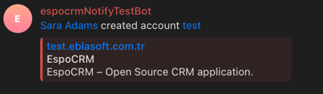
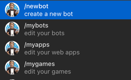
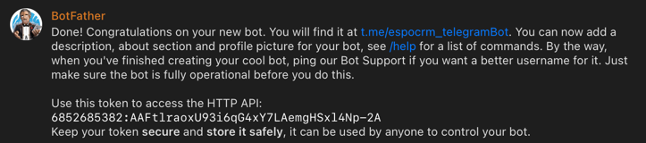
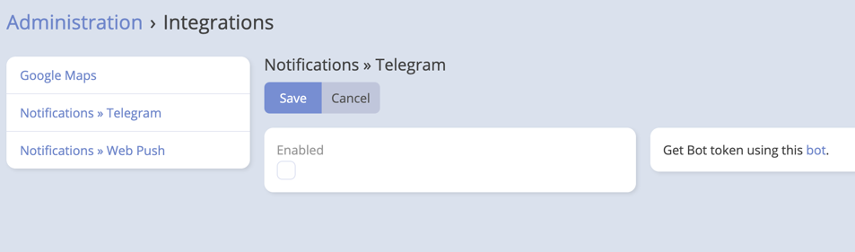
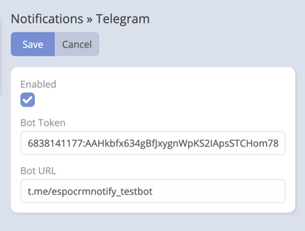
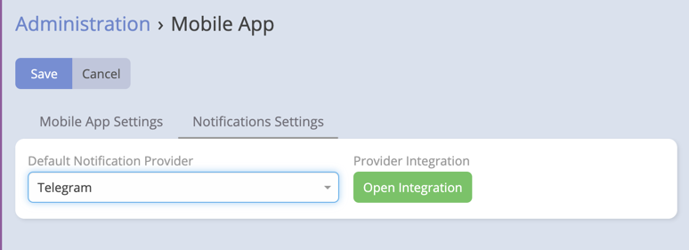
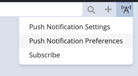
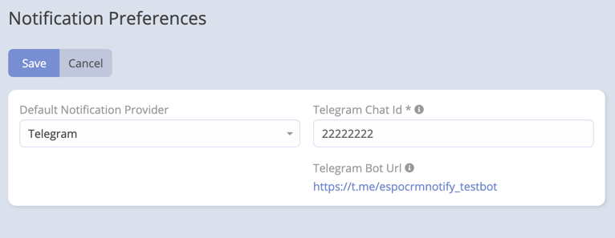

# Telegram Notifications

Use **Telegram** when you want EspoCRM notifications delivered directly to a user's Telegram chat through a bot.

This is a good option for teams that already work in Telegram and want alerts outside the browser.

---

## Before you start

To use Telegram delivery, you need:

- a Telegram bot,
- the bot token,
- the bot URL,
- the **Telegram** integration enabled in EspoCRM,
- a **Telegram Chat ID** for each user who wants to receive Telegram notifications.

---

## Admin setup

### Step 1: Create a Telegram bot

1. Open [BotFather](https://t.me/BotFather).
2. Create a new bot by following BotFather's instructions.
3. Save the bot token and bot URL returned by Telegram.

### Step 2: Configure the Telegram integration in EspoCRM

Open **Administration** → **Integrations** → **Telegram**.

Fill in:

- **Bot Token**
- **Bot URL**

Save and enable the integration.

### Step 3: Select Telegram as the notification provider

Open **Administration** → **Mobile App** → **Notifications Settings** and set **Default Notification Provider** to **Telegram**.

---

## User setup

Each user who wants Telegram delivery must complete their own **Notification Preferences**.

### Step 1: Start the bot in Telegram

Open the bot URL in Telegram and press **Start**.

This is important because Telegram bots can only message users who have started the bot conversation first.

### Step 2: Get your chat ID

One simple option is using [@myidbot](https://t.me/myidbot) to read your Telegram chat ID.

### Step 3: Save the chat ID in EspoCRM

Open **Notification Preferences** and paste the value into **Telegram Chat ID**.

### User fields explained

| Field | Purpose |
| --- | --- |
| **Default Notification Provider** | Lets the user switch to Telegram just for their account, or keep it blank to inherit the system default. |
| **Telegram Chat ID** | Required for Telegram delivery. |
| **Telegram Bot URL** | Read-only helper field showing the bot URL configured by the administrator. |

---

## What Telegram delivery supports

- Direct text notifications to the user's Telegram chat.
- Delivery based on the user's active notification provider.
- Reminder notifications when reminders are configured to use the notification channel.
- Media delivery when a notification includes attachments.

If a user has no saved **Telegram Chat ID**, EspoCRM cannot deliver Telegram notifications for that user.

---

## Troubleshooting

### The user does not receive messages

Check these items:

- the **Telegram** integration is enabled,
- the bot token and bot URL are correct,
- the user pressed **Start** in the bot chat,
- the user saved the correct **Telegram Chat ID**,
- Telegram is the active provider globally or for that user.

### The bot URL looks different in Notification Preferences

The module stores the bot URL centrally and shows it to users as a read-only helper field in **Notification Preferences**.

### Reminder notifications are missing

Confirm that reminder notifications are configured and that scheduled jobs are running normally in your EspoCRM instance.

---

## Related guides

- [Mobile App overview](../../index.md)
- [PWA guide](../../pwa.md)
- [WebPush guide](../webpush/overview.md)
