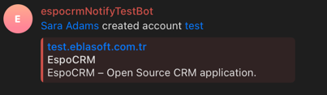
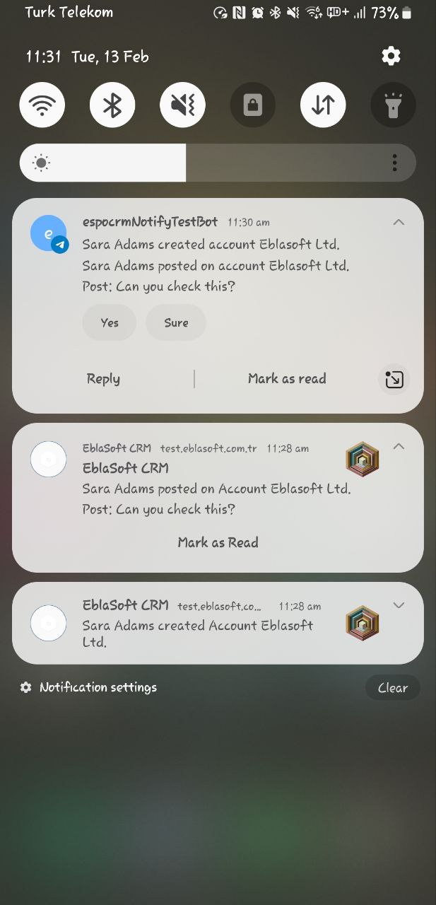

# Telegram Integration Overview

The Telegram Integration in the Mobile App extension for EspoCRM enhances communication and notification capabilities by
leveraging the Telegram messaging platform. With this integration, users can receive real-time updates, alerts, and
notifications directly through their Telegram accounts.

## What is Telegram Integration?

Telegram Integration allows EspoCRM to seamlessly connect with Telegram, a popular messaging platform known for its
security and feature-rich environment. By integrating Telegram, users can receive important notifications, messages, and
updates from EspoCRM directly within their Telegram chat.

## Key Features

### 1. Instant Notifications

- Receive instant notifications directly in your Telegram chat, ensuring timely information.

### 2. Secure Communication

- Leverage the security features of Telegram for confidential and secure communication between EspoCRM and users.

### 3. Easy Configuration

- Simple setup process for administrators to integrate Telegram with EspoCRM through the administration panel.