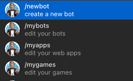
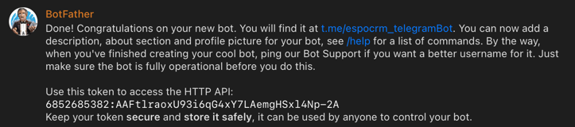
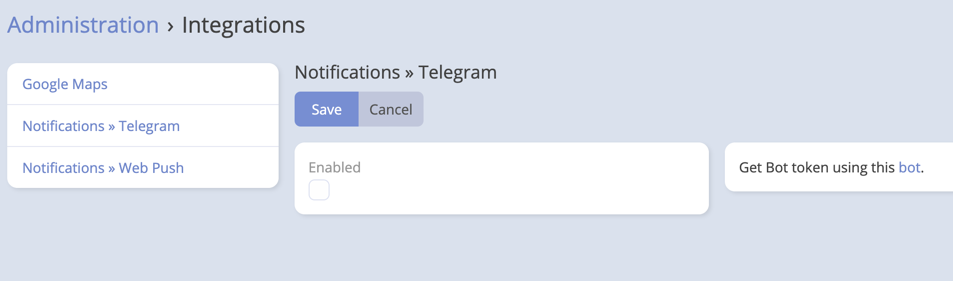
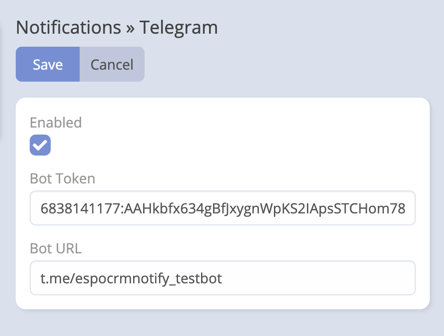
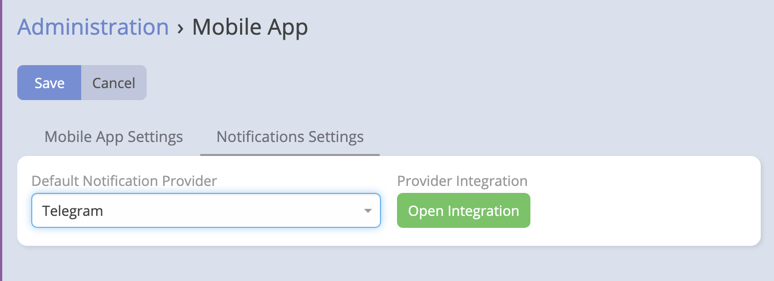
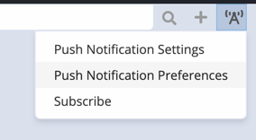
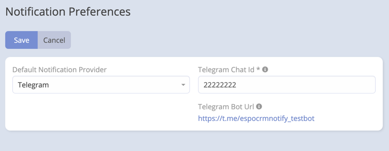

### Telegram Integration Setup

#### Bot Setup

1. Go to [BotFather](https://t.me/BotFather) on Telegram.

2. Create a new bot by following the on-screen instructions from BotFather.

   

3. Copy the Bot ID and Bot URL provided by BotFather.

   

4. Open your newly created bot on Telegram and press "Start" to initialize the bot.

5. Go to [@myidbot](https://t.me/myidbot) and press "Start" to get your Telegram ID. Copy the Telegram ID.

#### EspoCRM Setup

1. Navigate to **Integrations** -> **Telegram**.

   

2. Paste the Bot ID and Bot URL obtained from BotFather.

   

3. Go to **Administration** -> **Mobile App** -> **Notifications Settings**.

4. Set the "Default Notification Provider" to "**Telegram**."

   

5. Ensure your Telegram bot is open by visiting the Bot URL and pressing "Start."

6. Go to **Notification Preferences**.

   

7. Paste your Telegram ID in the "Telegram Chat ID" field.

   

Now, your EspoCRM instance is configured to use Telegram for push notifications.

### Troubleshooting:

- Double-check the Bot ID, Bot URL, and Telegram ID for accuracy.
- Review your server logs for any error messages related to Telegram integration.
