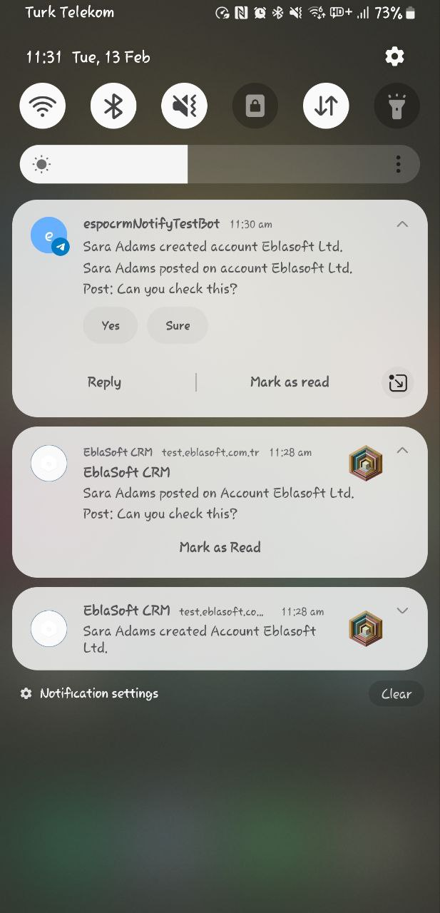
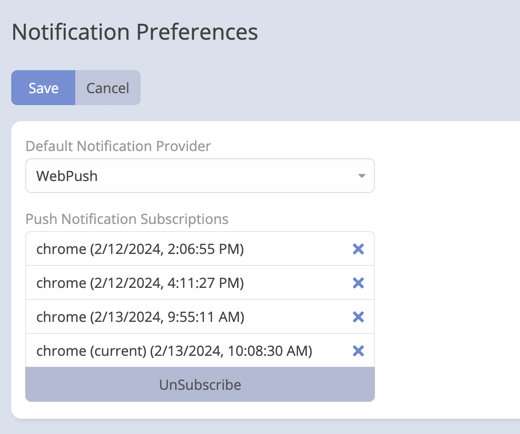
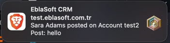

# Push Notification Feature with WebPush

The Push Notification feature in the Mobile App extension for EspoCRM leverages the WebPush library to provide real-time
notifications to users. This feature supports both Progressive Web App (PWA) environments and native web browsers,
enhancing user engagement and keeping users informed about important events within EspoCRM.

## What is WebPush?

WebPush is a web platform feature that enables websites and web applications to send real-time push notifications to
users' devices, even when the website is not open. It provides a standardized way for web applications to engage users
with timely updates and alerts.

 

## Key Features

### 1. Cross-Browser Compatibility

- WebPush notifications are supported in both PWA environments and native web browsers, ensuring a consistent experience
  across different platforms.

### 2. Real-Time Updates

- Users receive instant notifications about essential events, tasks, or updates within EspoCRM, enhancing user awareness
  and engagement.

### 3. Personalized Notification Preferences

- Users have control over their notification preferences.

### 4. Easy Integration with WebPush Library

- The WebPush library simplifies the integration process, making it straightforward for administrators to set up and
  manage push notifications.

## Setting Up Push Notifications with WebPush

Follow these [steps](setup.md) to set up Push Notifications with the WebPush library:
