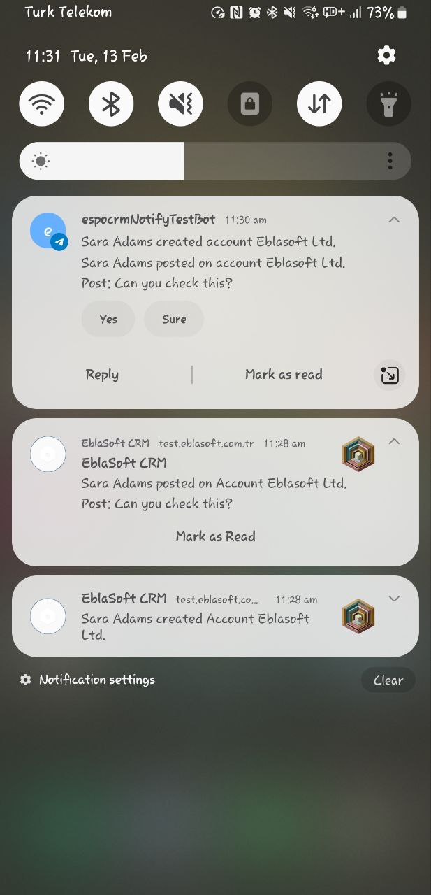
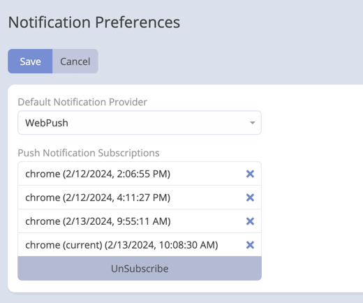
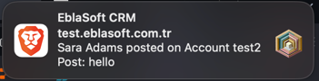
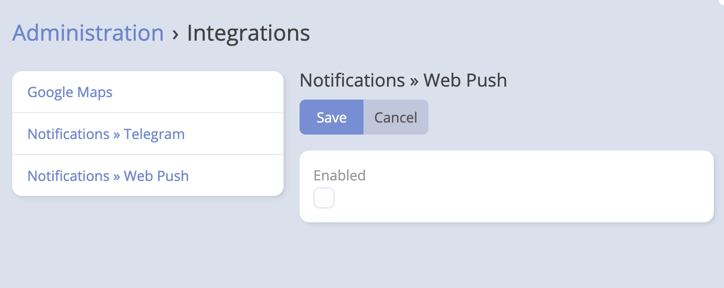
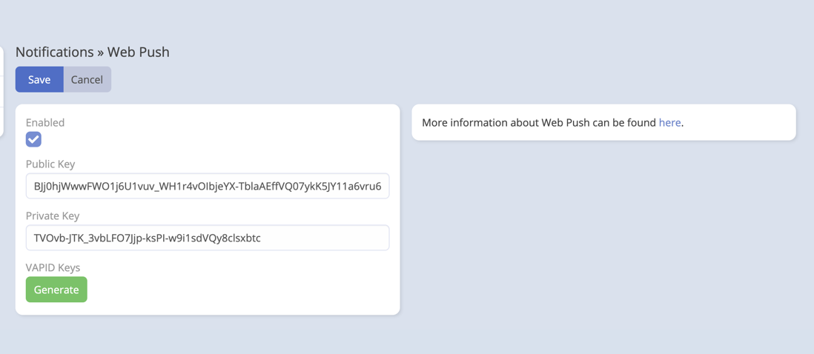
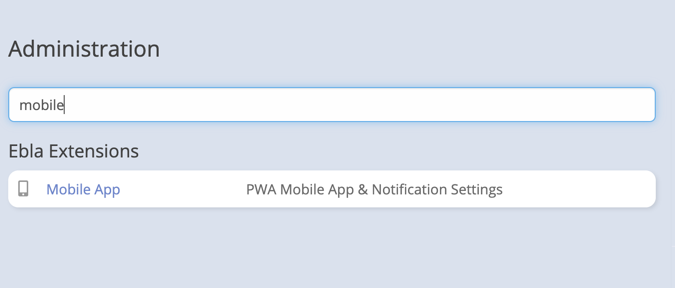
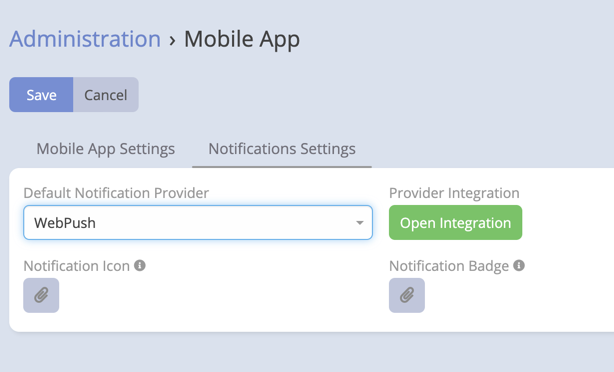
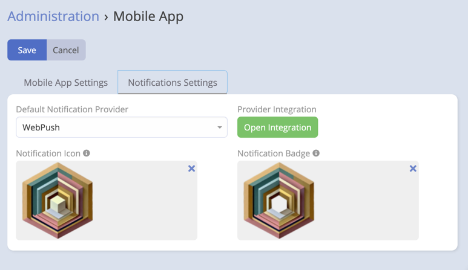
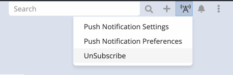
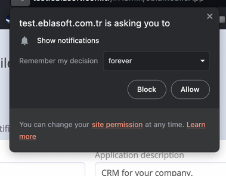

# WebPush Notifications

Use **WebPush** when you want users to receive browser notifications from EspoCRM on supported desktop and mobile browsers.

This provider works with the module's PWA features, but users can also receive browser notifications without installing the app as a PWA if their browser supports the required APIs.

---

## Before you start

WebPush works best when all of the following are true:

- your CRM is served over **HTTPS**,
- the browser supports **service workers**,
- the browser supports **push notifications**,
- the **Web Push** integration is enabled,
- valid **VAPID keys** are stored in the integration,
- **WebPush** is selected in **Administration** → **Mobile App** as the active default provider for browser subscription setup.

If one of these is missing, users may not be able to subscribe successfully.

---

## Admin setup

### Step 1: Configure the Web Push integration

Open **Administration** → **Integrations** → **Web Push**.

This integration stores:

- **Public Key**
- **Private Key**

If you do not already have VAPID keys, use the built-in **Generate** button.

Then enable the integration and save it.

### Step 2: Select WebPush in Mobile App settings

Open **Administration** → **Mobile App**.

Set **Default Notification Provider** to **WebPush**.

### Step 3: Optional WebPush presentation settings

While WebPush is the selected provider, you can also define:

- **Notification Title**
- **Notification Icon**
- **Notification Badge**

The title supports placeholders such as:

- `{entity}`
- `{entityType}`
- `{action}`

These values are filled from the notification being sent.

---

## User setup

Users can subscribe in two places:

1. from the navbar notification dropdown,
2. from **Notification Preferences**.

### What users should know

- The browser will ask for notification permission.
- Each browser or device creates its own saved subscription.
- A user can keep their **Default Notification Provider** blank to inherit the system default.
- The saved subscriptions list is user-specific.

For the smoothest setup, enable **WebPush** as the main Mobile App default before asking users to subscribe browsers.

The module can also label the current browser subscription separately in the user's subscription list.

---

## What happens when a push notification arrives

- The browser shows the notification with the configured title, icon, and badge when available.
- Opening the notification can take the user directly to the related record.
- Some notifications also include a **Mark as Read** action.
- Reminder notifications can use the same provider when reminders are configured to use the notification channel.

---

## Troubleshooting

### Users cannot subscribe

Check these first:

- the site is loaded over **HTTPS**,
- **Web Push** integration is enabled,
- the VAPID keys are filled in,
- **WebPush** is selected as the active provider,
- the browser has not blocked notification permission.

### Notifications are not arriving

- Ask the user to verify they are subscribed in **Notification Preferences**.
- Re-check the provider selection in both **Administration** and the user's own preferences.
- Review the server logs for push delivery errors.
- If a browser subscription has expired, ask the user to subscribe again.

### The install checklist fails

See the main [PWA guide](../../pwa.md) and verify the failed item from the checklist panel.

---

## Related guides

- [Mobile App overview](../../index.md)
- [PWA guide](../../pwa.md)
- [Telegram guide](../telegram/overview.md)
