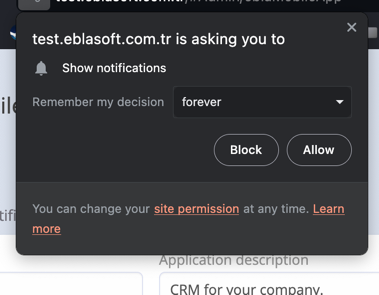

### WebPush Setup

1. Navigate to **Integrations** -> **Web Push**.

   

2. Add VAPID (Voluntary Application Server Identification) public and private keys. If you don't have keys, you can
   press the "Generate" button to create them.

   

3. Go to **Administration** -> **Mobile App** -> **Push Notifications Configuration**.

   

4. In the Push Notifications Configuration, find the "Default Provider" setting and change it to "WebPush."

   

5. Setup Notification Icon and Badge by uploading a PNG images.
    

!!! warning "For Chrome 53+ on Android 6.0+, the badge replaces the Chrome browser icon that appears on the notification tray and above the title. In this example, a custom badge for the app replaces the Chrome browser icon"

|**Note**       |   Must use an HTTPS URL                                                                                                                                                     |
|---------------|--------------------------------------------------------------------------------------------------------------------------------------------------------|
| **Color**     | **Alpha** channel only   Not supported: RGB channels. Badges use alpha channels because they must appear on both light and dark backgrounds. |
| **Resolution** | `72x72` or larger                                                                                                                                      |
| **Filetype**  | `png`, `gif`, `webp`, `ico`, `cur`, `bmp` Not supported: `svg`                                        

6. Users can subscribe and unsubscribe to push notifications from **Push Notification Preferences**.

   

> Now, your EspoCRM instance is configured to use WebPush for push notifications.

### Note:

- Ensure that your [browser supports](https://developer.mozilla.org/en-US/docs/Web/API/Push_API#browser_compatibility)
  WebPush.
- Users need to grant permission to receive push notifications when prompted by the browser.

 

### Troubleshooting:

- If users are not receiving push notifications, double-check the VAPID keys and ensure that the WebPush provider is
  correctly set as the default in the Push Notifications Configuration.
- Review your server logs for any error messages related to push notifications.
