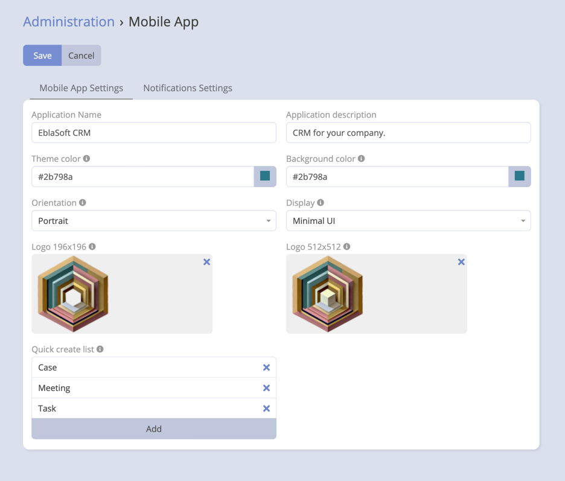
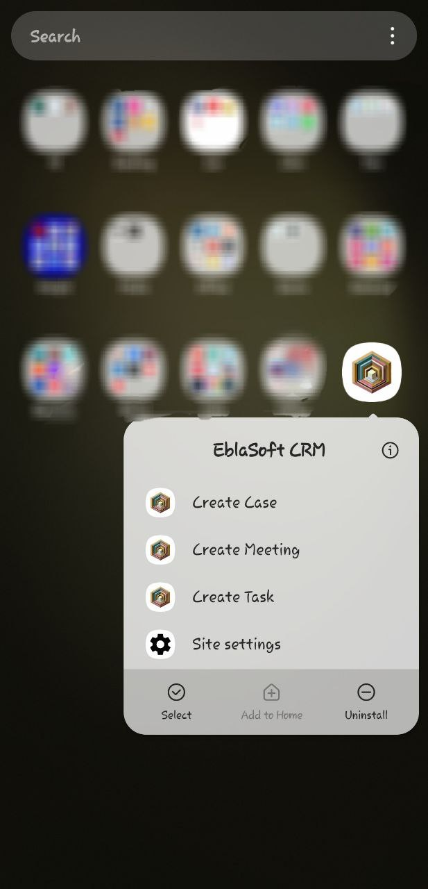
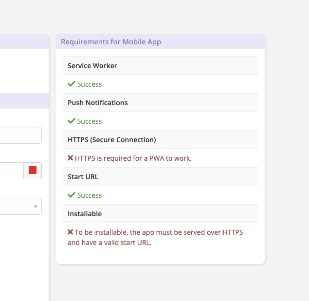
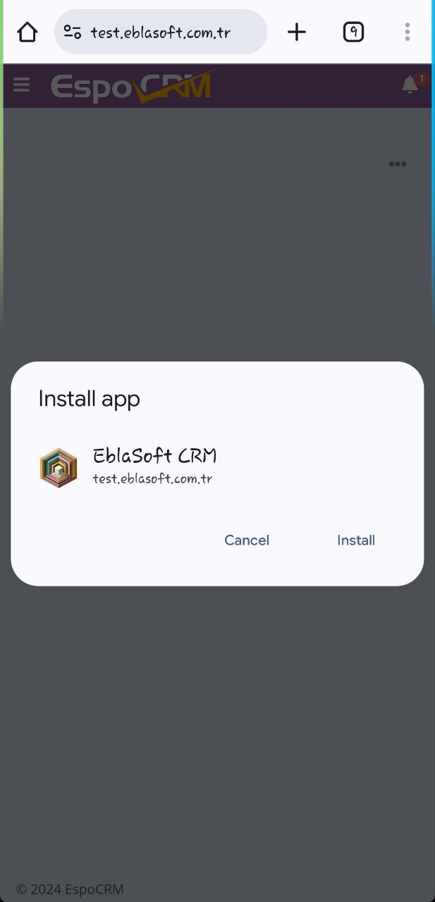
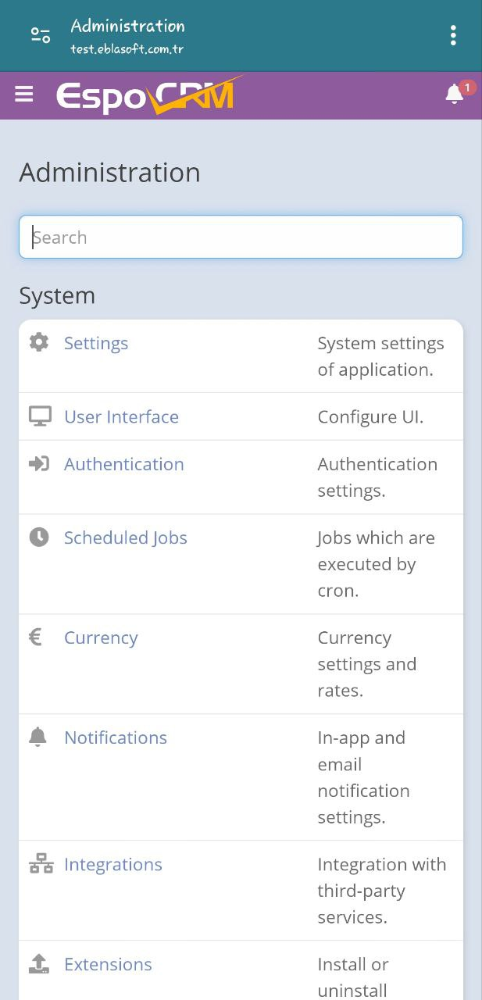

# Progressive Web App (PWA)

The PWA part of **Ebla Mobile App** lets supported browsers install your EspoCRM instance like an app on mobile and desktop devices.

It focuses on **branding**, **installability**, and **quick access**. It does **not** promise a separate native mobile app package.

---

## What you can control

Open **Administration** → **Mobile App** and use the **Mobile App Settings** section.

| Setting | Purpose |
| --- | --- |
| **PWA Application Name** | The app name shown in the install experience and manifest. |
| **PWA Application Description** | Description used by the manifest. |
| **PWA Theme Color** | Brand color used by supported browsers in install and app UI surfaces. |
| **PWA Background Color** | Background color used during supported launch and splash experiences. |
| **PWA Orientation** | Preferred screen orientation for the installed app. |
| **PWA Display** | Display mode for the installed app: **fullscreen**, **standalone**, **minimal-ui**, or **browser**. |
| **PWA Logo 196** | Smaller application icon. |
| **PWA Logo 512** | Larger application icon. |
| **PWA Quick Create List** | Creates application shortcuts that open record creation directly from the installed app menu. |

### Display modes

- **Fullscreen**: hides almost all browser chrome.
- **Standalone**: app-like window with minimal browser framing.
- **Minimal-UI**: similar to standalone, but browsers may keep a small navigation UI.
- **Browser**: opens like a normal browser tab.

### Quick Create shortcuts

The **PWA Quick Create List** is useful when users often create the same record types from mobile devices. Each selected entity becomes a shortcut in browsers that support app shortcuts.

---

## Installability checklist

The side panel **Requirements for Mobile App** checks whether your current environment is ready for installation.

The checklist evaluates these items:

| Requirement | What it means |
| --- | --- |
| **Service Worker** | The current browser supports service workers. |
| **Push Notifications** | The current browser supports the push API. |
| **HTTPS** | The CRM is served over `https://`. |
| **Start URL** | The configured site URL matches the current origin well enough for installation. |
| **Icon** | A valid app icon is available from your uploaded PWA logos or the company logo fallback. |
| **Installable** | The basic installation conditions are satisfied. |

> The checklist is browser-aware. A requirement can pass on one device and fail on another if the browser does not support the needed PWA features.

---

## Recommended setup flow

1. Open **Administration** → **Mobile App**.
2. Fill in the branding fields:
   - application name,
   - application description,
   - theme color,
   - background color.
3. Choose the preferred **orientation** and **display** mode.
4. Upload at least one usable icon, ideally both **196** and **512** sizes.
5. Configure the **Quick Create List** if you want installed-app shortcuts.
6. Review the **Requirements for Mobile App** side panel and fix any failed checks.

---

## How users install the app

Once the environment is ready, users can:

1. Open the CRM URL in a supported browser.
2. Use the browser's **Install App** or **Add to Home Screen** action.
3. Launch EspoCRM from the installed icon like an app.

After installation, the CRM opens using the configured display mode and branding.

---

## Good practices

- Use **HTTPS** for production.
- Upload clear square icons for the best install experience.
- Keep the **PWA Application Name** short enough to display nicely on smaller screens.
- Add only the most useful entities to **PWA Quick Create List**.
- Test installation on the browsers and devices your team actually uses.

---

## Related guides

- [Mobile App overview](index.md)
- [WebPush guide](providers/webpush/overview.md)
- [Telegram guide](providers/telegram/overview.md)
