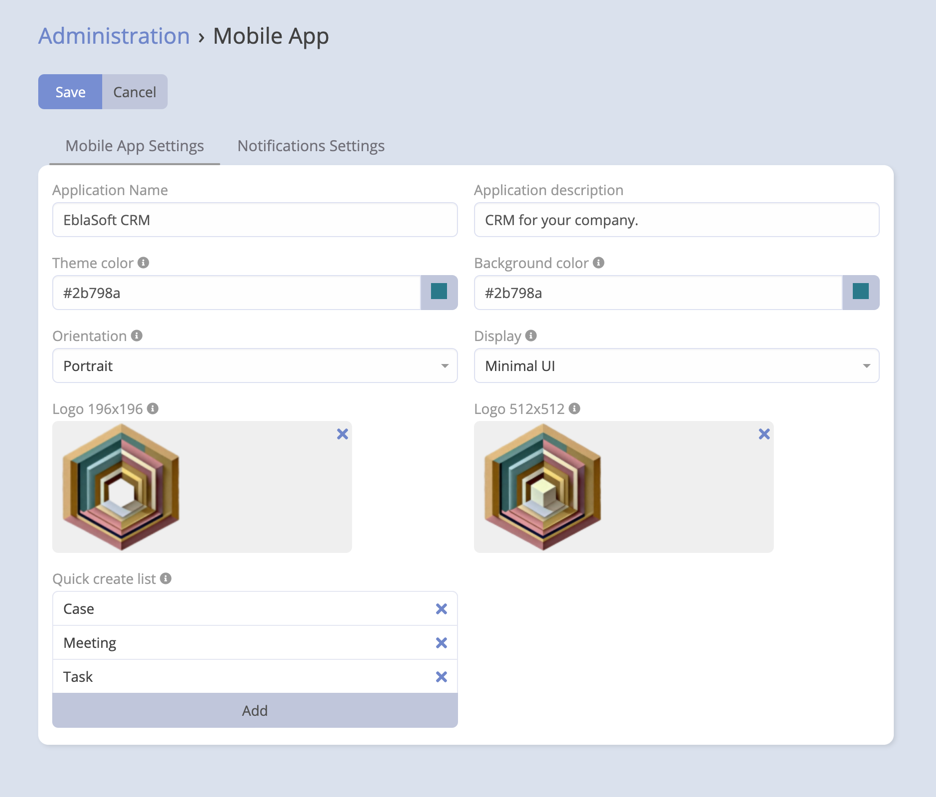

# Progressive Web App (PWA) Overview

The Progressive Web App (PWA) feature in the Mobile App extension for EspoCRM enhances user experience by enabling the
application to function as a native-like app on supported devices. PWAs offer a seamless, reliable, and fast experience,
providing users with the ability to access EspoCRM even when offline.

## What is a Progressive Web App (PWA)?

A Progressive Web App (PWA) is a type of web application that utilizes modern web technologies to provide a native
app-like experience to users. PWAs offer features such as offline access, push notifications, and device hardware
access, all while being accessible through a web browser. They provide a responsive and engaging user experience,
similar to that of native mobile apps.

## Key Features of PWA Integration

### 1. Theme Color and Background Color Customization

- Customize the theme color and background color of the PWA to match your brand identity or design preferences.

### 2. Orientation Control

- Control the orientation of the PWA, allowing users to experience the app in their preferred orientation (landscape or
  portrait).

### 3. Logo Customization

- Upload custom logos for the PWA in different sizes (196x196 and 512x512) to ensure brand consistency and recognition.

### 4. Display Mode Options

- Choose from different display modes for the PWA, such as fullscreen, standalone, minimal-ui, or browser mode, to
  provide the best user experience based on device and browser capabilities.

### 5. Quick Create List Configuration

- Configure the quick create list for the PWA, allowing users to easily access and create records directly from the PWA
  interface.

  

## Setting Up the Progressive Web App (PWA)

To set up the Progressive Web App (PWA) feature in EspoCRM, follow the steps below:

- Navigate to the `Administration` panel and click on `Mobile App` in the `Ebla Extensions` section.

- Setup Mobile App theme & preferences as per your requirements.

  

### Settings

- **Theme Color**: Choose the theme color for the PWA (Navbar and splashscreen etc).
- **Background Color**: Choose the background color for the PWA.
- **Orientation**: Choose the orientation for the PWA (landscape or portrait).
- **Display Mode**: Choose the display mode for the PWA:
    - **Fullscreen**: The PWA will open in fullscreen mode.
    - **Standalone**: The PWA will open in standalone mode.
    - **Minimal-UI**: The PWA will open in minimal-ui mode.
    - **Browser**: The PWA will open in browser mode.
- **Quick Create List**: Configure the quick create list for the PWA.
- **PWA Logo**: Upload custom logos for the PWA in different sizes (196x196 and 512x512).

## Requirements Checklist

To help you check if you have met all the requirements for setting up the Progressive Web App (PWA) feature, you can see the checklist panel
It will show you the status of each requirement.

## Accessing the Progressive Web App (PWA)

Once the PWA feature is set up, users can access the PWA by following the steps below:

- Open the web browser on your device and navigate to the EspoCRM URL.

- Click on the `Install App` option in the browser menu to add the PWA to your device.

- The PWA will be added to your device's home screen, allowing you to access EspoCRM as a native-like app.

