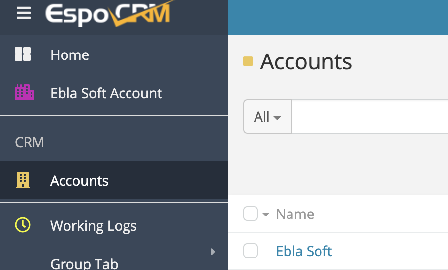
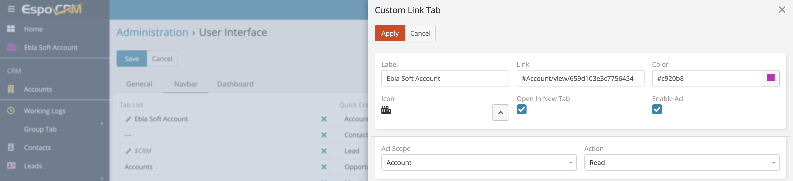

# Add Custom Links with Tabs 

>Ability to add custom links to navigation menu in EspoCRM is available
in [Ebla Navigation Pro](https://www.eblasoft.com.tr/espocrm-extension-page/espocrm-navigation-pro).

---

---

**-** Go to **Administration** -> **User Interface** -> **Navbar** -> **Add Custom Link** .

 

**Features:**

- ### [Custom Links](custom-links-with-tabs.md)

- ### [Favorite Entities](favorite-entities.md)

- ### [Favorite Records](favorite-records.md)

- ### [Separator](separator.md)

###  [ChangeLog](changelog.md) 