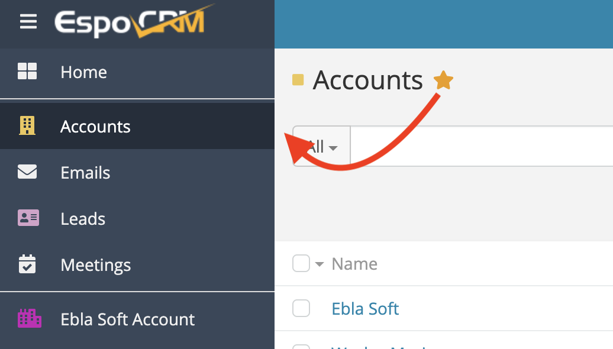
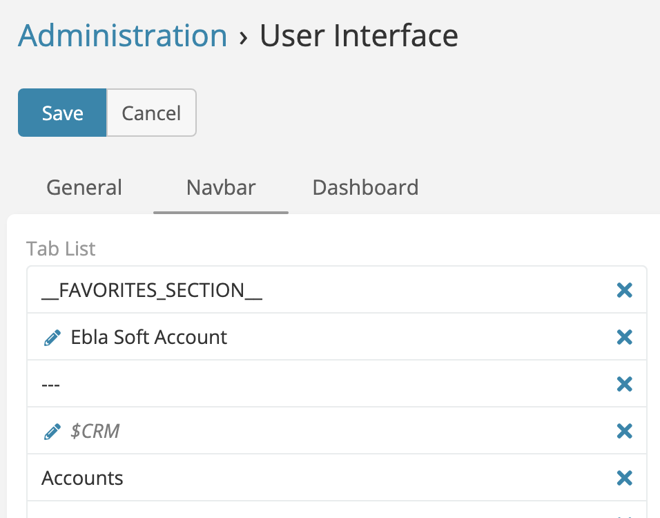

# Favorite Entities

> The Favorite Entities extension allows you to add a favorite button to your entities in EspoCRM. This button will allow you to
> quickly access your favorite entities from the navigation drawer.
> Is available in [Ebla Navigation Pro](https://www.eblasoft.com.tr/espocrm-extension-page/espocrm-navigation-pro).

---

---

1. Go to **Administration** -> **User Interface** -> **Navbar** -> **Add** -> **__FAVORITES_SECTION__**.
2. Add **__FAVORITES_SECTION__** to **Tab List**.

