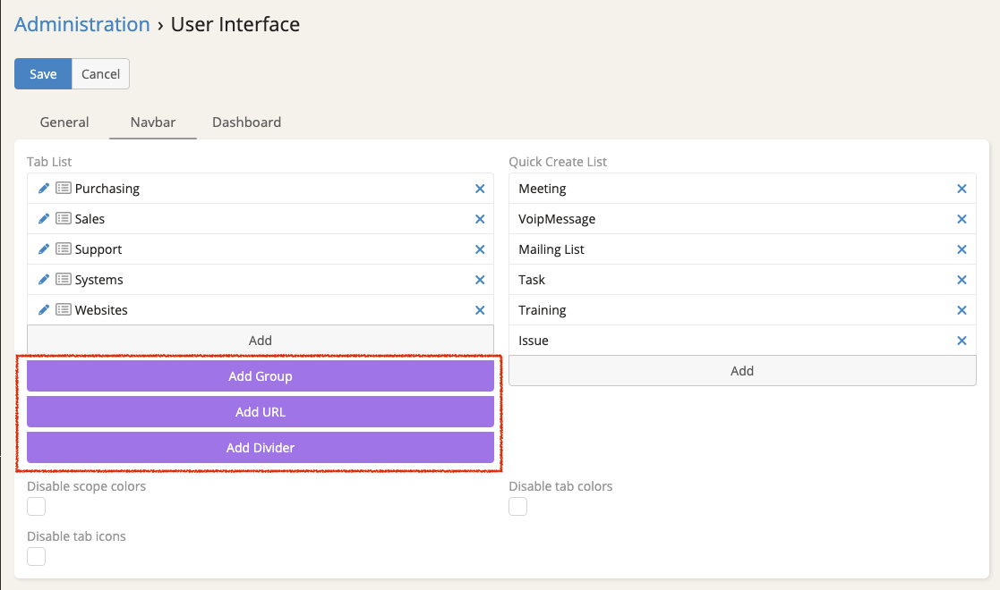
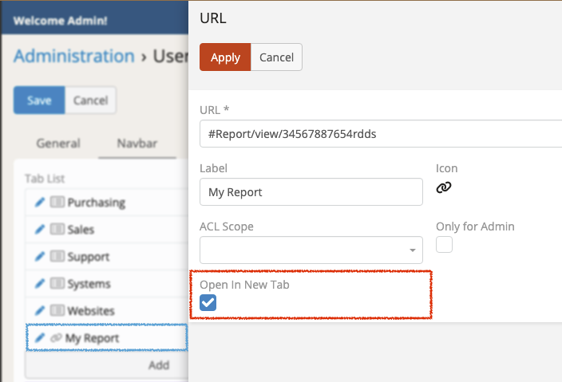
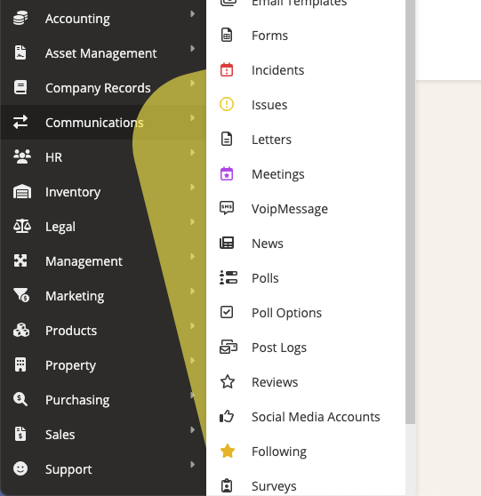
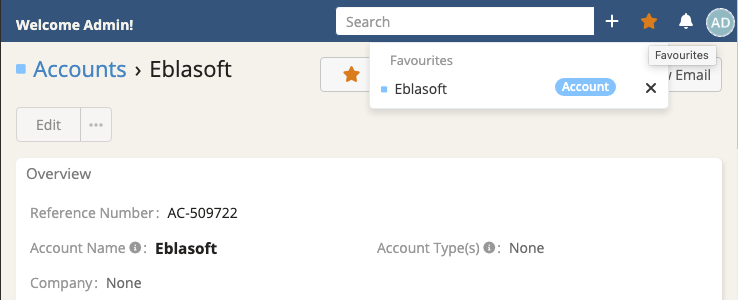
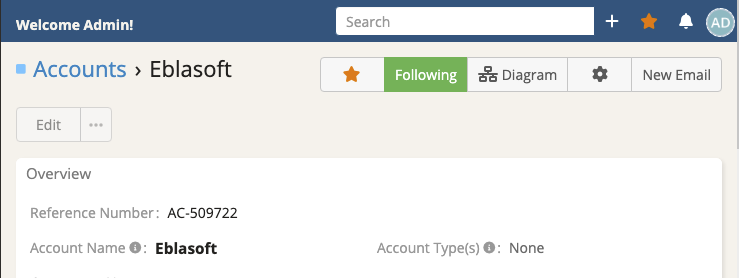
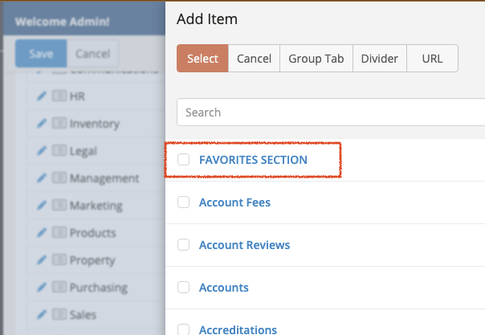
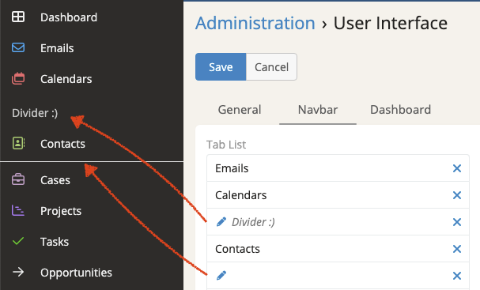

# Espocrm Nav Pro 

## Overview
Ebla Nav Pro is an extension for EspoCRM that enhances the navigation experience by introducing several new features and improvements to the navigation system.

- Quick add buttons.
- Custom links.
- Mouse hover open sub-menu.
- Favorites menu
- Favorites tabs section
- Menu separator line.

These features aim to streamline the navigation process, improve user productivity, and provide a more intuitive and efficient user experience within EspoCRM.

## 1. Quick Add Buttons

Ebla Nav Pro introduces quick add buttons for creating new group, url & divider directly from the tab list field.

See the image on the right (click on the picture to see the full size).

{ width=500px }

## 2. Open in New Tab

!!! note "Note"
    Custom links added to EspoCRM since 8.2.0 version, for older versions, Ebla Nav Pro extension is required.

Espocrm Nav Pro allows users to open custom links in a new tab, see the image below.

{ width=500px }

## 3. Mouse Hover Sub Menu

With Ebla Nav Pro, hovering over menu items opens a sub-menu, enhancing navigation efficiency. The extension supports hover indent areas for better UX, ensuring making it smooth and intuitive navigation.

{ width=500px }

## 4. Favourite Menu on Top Navigation Bar

Users can mark records as favorites, and Ebla Nav Pro displays a dedicated Favourites menu on the top navigation bar for quick access to these records. This feature streamlines the workflow by providing easy access to frequently accessed records.

!!! note "Note"
    Favourite records added to EspoCRM since 8.3.0 version, for older versions, Ebla Nav Pro extension is required.

{ width=500px }
{ width=500px }

## 5. Favourites Tabs Section

This feature allow espocrm  users to have a section in the nav tabs for their favourite screens on the fly like account or contacts.

{ width=500px }
{ width=500px }

<iframe width="500" height="275" src="https://www.youtube.com/embed/ncVHWC0pPug?si=Zm5tt84jvwFT-LDy" title="YouTube video player" frameborder="0" allow="accelerometer; autoplay; clipboard-write; encrypted-media; gyroscope; picture-in-picture; web-share" referrerpolicy="strict-origin-when-cross-origin" allowfullscreen></iframe>

## 6. Menu Separator Line
Ebla Nav Pro includes a menu separator line feature, allowing users to visually organize the navigation menu by adding separators between menu items. This feature improves the clarity and structure of the navigation menu.
To add a separator line, just add divider and leave the Label field empty.
This is only for side menu.

{ width=500px }

## Support
For any questions, issues, or feedback regarding Ebla Nav Pro extension, please contact us to eymen@eblasoft.com.tr or refer to the official Eblasoft support portal to log a ticket.

## ChangeLog

