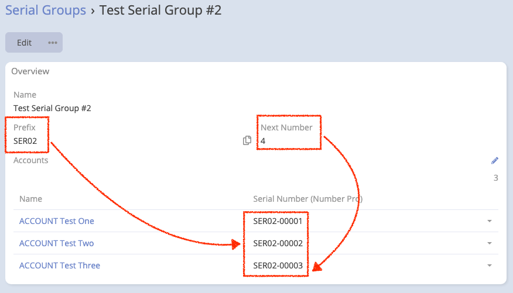
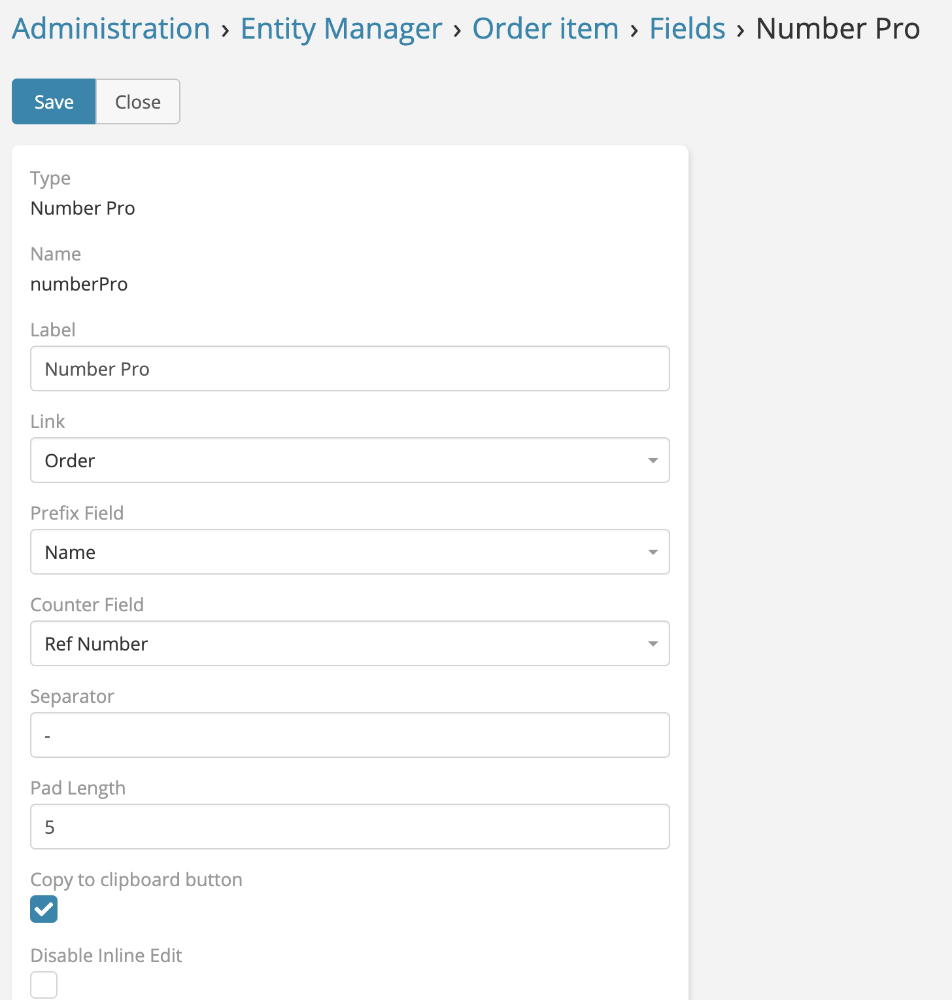

# Number Pro 

> Auto Increment in EspoCRM (**Number Pro field**) available
> in [Ebla Number Pro](https://www.eblasoft.com.tr/espocrm-extension-page/number-pro).

---

---

1. Go to **Administration** -> **Entity Manager** -> **{Entity Type}** -> **Fields**.
2. Create a new field with type **Number Pro**.

## ChangeLog

