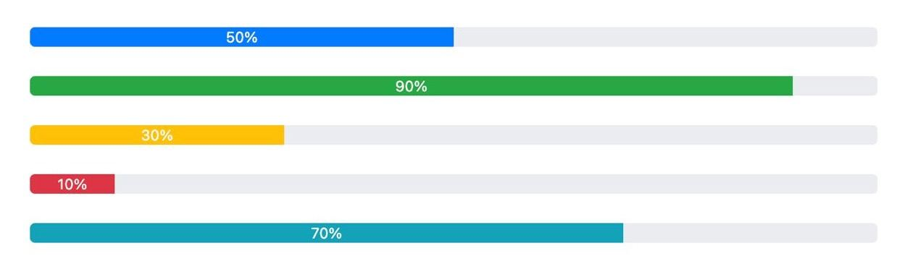
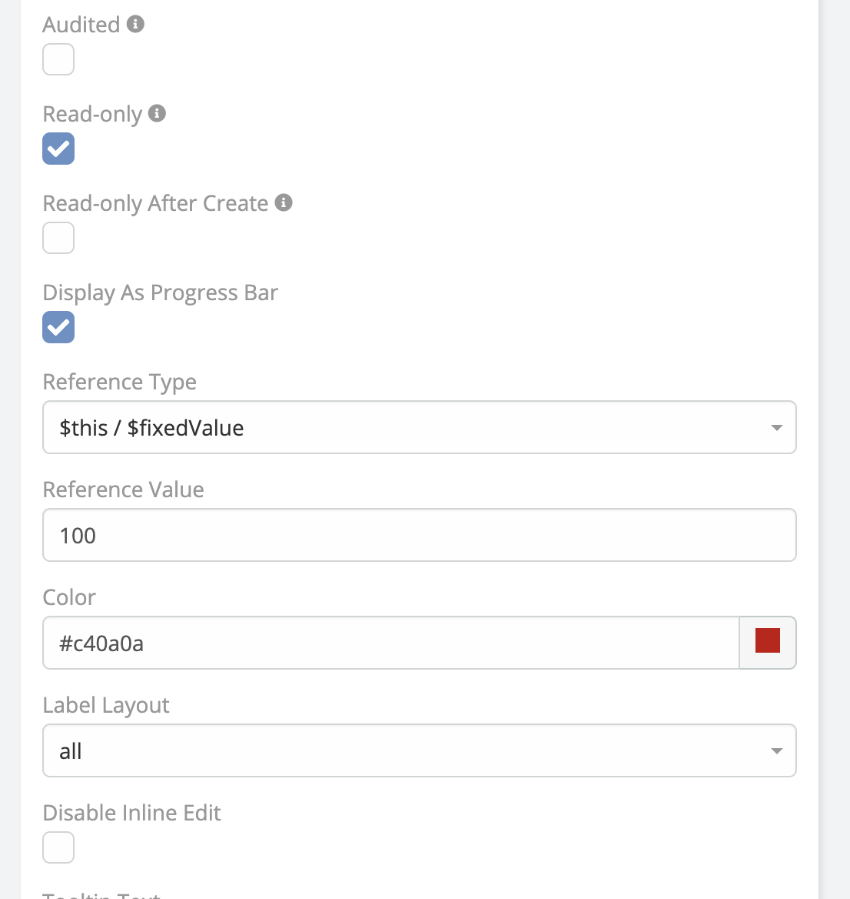

# Espocrm Progress Bar Documentation 

## Overview
**Ebla Progress Bar** for EspoCRM enhances visualization by displaying progress bars for **Integer, Float, and Currency** fields in both **List and Detail** views.

## Key Features

### Visual Representation of Numeric Fields
Enhance user experience by transforming numeric values into progress bars, making data more readable at a glance.

### Simple Configuration
Enable the progress bar display with just a few clicks from the **Entity Manager**.

### Fully Compatible
Works seamlessly with **List View** and **Detail View** in EspoCRM.

## How to Enable Progress Bar

1. Navigate to **Administration** → **Entity Manager**.
2. Select the desired **Entity Type**.
3. Go to the **Fields** section.
4. Create a new field of type **Integer, Float, or Currency**.
5. Enable the option **Display As Progress Bar**.

!!! note "Note"
The progress bar is only available for **Integer, Float, and Currency** fields.

## Change Log

