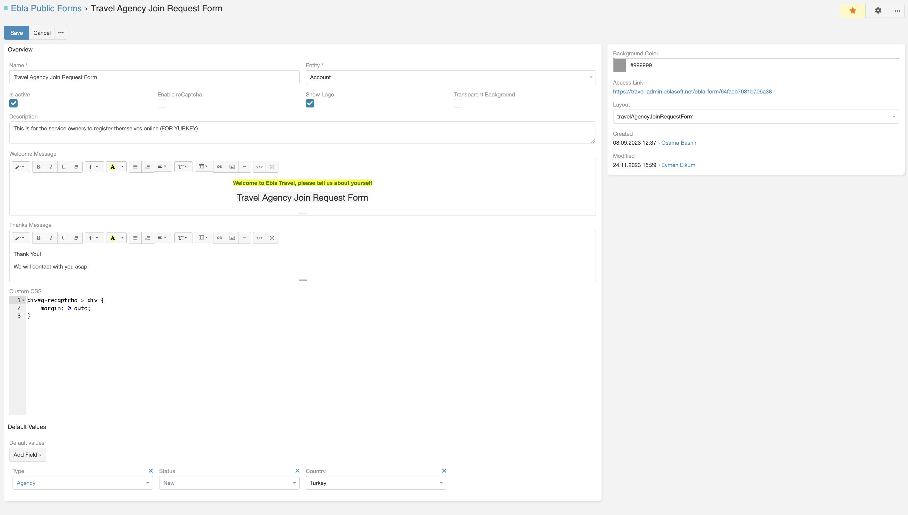

# Ebla Public Form

## Overview

The "Ebla Public Form" extension for EspoCRM provides a solution for creating, managing, and **embedding Espocrm forms publicly on websites**.

## Use Cases

1. **Collect Feedbacks from Clients** <br>
    Utilize star rate extension for enhanced feedback collection.

2. **Collect CVs** <br>
    Gather resumes or CVs directly through custom forms.

3. **Receive Tickets to Case Entity** <br>
    Streamline the process of submitting tickets by allowing users to fill out forms directly.

4. **Registration for Portal Users** <br>
    Enable seamless registration for portal users with customizable forms.

## Existing Features

1. **Welcome & Thank You Messages** <br>
    Customize welcome and thank you messages for users filling out forms.

2. **reCaptcha** <br>
    Ensure the security of your forms with reCaptcha integration.

3. **Control Form Design** <br>
    1. Options for showing/hiding the logo, changing the background color, and more. <br>
    2. Ability to write custom CSS for further customization.

4. **Default Fields** <br>
    Predefined fields like name, email, phone, and message for quick form creation.

5. **Url Field Value** <br>
    Populate fields with values from the URL. This allows for pre-filling fields with data from the URL.
    Use case: Pre-fill the contact id and ticket id in the form URL to use on formula script later.

    ``` title="Example:"
    Add ?website=eblasoft.com.tr to the form URL to pre-fill the website field.
   
    https://your-crm.com/ebla-form/xxxxxxxx?website=eblasoft.com.tr
    ```

6. **Custom Detail Layout** <br>
    You can create a custom detail layout for the form entity to show the form fields in a specific order.

7. **Support all Scopes** <br>
    Support all scopes for any entity type, Lead, Contact, Account, Case, etc. Plus custom entities.

8. **Easy Link Distribution via Email Templates** <br>
    Send form links effortlessly using pre-designed email templates.
    You can fill fields dynamically in the email template using the url field value feature.

9. **Embeddable Forms** <br>
    Seamlessly integrate forms into your website using IFrames.

10. **Support for Espo Dynamic Logic** <br>
    You can use EspoCRM dynamic logic to show/hide fields based on conditions.

## Getting Started

After installing the "Ebla Public Form" extension, you can start creating forms from Administration > Ebla Public Form Defs > Create Ebla Public Form.

## Configuration
- **eblaFormClientPath**: <br>
    default is `../../` (relative path to EspoCRM root directory). you can change it to `../` if you have EspoCRM installed in a subdirectory.
- **allowEblaFormUploads**: <br>
  default is `false`. If you want to allow file uploads, set it to `true`.



## Support and Feedback

For any inquiries, support, or feedback regarding the "Ebla Public Forms" extension, please reach out to our portal create a ticket. We are committed to ensuring a seamless experience and are here to assist you with any questions or concerns you may have.

### <font color=gray> [ChangeLog](changelog.md) </font>

## Conclusion

With the "Ebla Public Forms" extension, EspoCRM users can get the full benefits of Espocrm forms by embedding them on websites. This extension provides a simple and efficient way to collect data, feedback, and more from users, streamlining the process and enhancing user experience.
