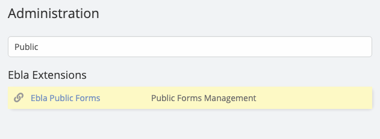
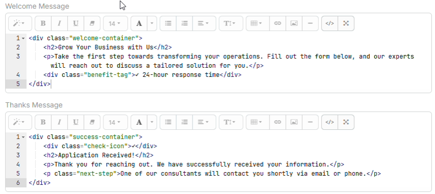
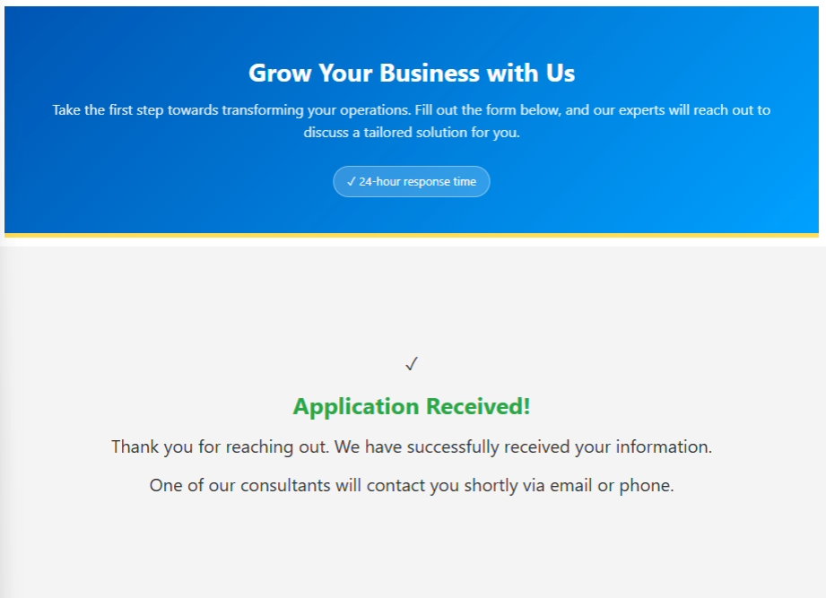
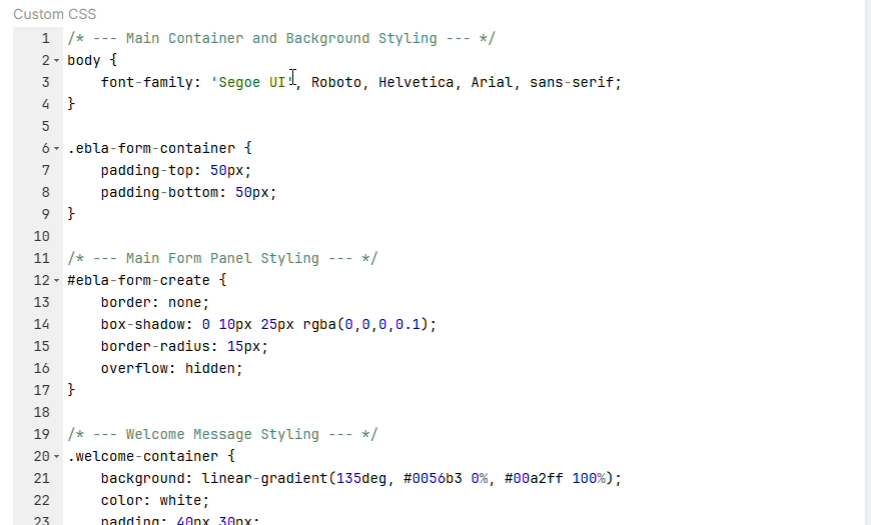

# Ebla Public Form

## Overview

**Ebla Public Form** for EspoCRM allows publishing EspoCRM forms publicly on websites.

This extension provides a simple and efficient way to collect data, feedback, and more by generating public-facing forms that feed directly into your CRM entities.

---
<iframe width="650" height="315" src="https://www.youtube.com/embed/wS2jND4ck48" frameborder="0" allow="accelerometer; autoplay; clipboard-write; encrypted-media; gyroscope; picture-in-picture" allowfullscreen></iframe>

---



!!! note
    If you need to embed forms on your website using iframe, you need to enable `clientXFrameOptionsHeaderDisabled` in EspoCRM configuration.
   
    ```php
      // config.php
      'clientXFrameOptionsHeaderDisabled' => true,
    ```

!!! warning
    **Ebla Public Form** doesn't support link field for security reasons. You can only pass link id via url, example: `https://your-crm.com/ebla-form/xxxxxxxx?contactId=xxxxx`.

## Use Cases

1. **Collect Feedbacks from Clients** <br>
   Utilize star rate extension for enhanced feedback collection.

2. **Collect CVs** <br>
   Gather resumes or CVs directly through custom forms using file/attachment upload fields.

3. **Receive Tickets to Case Entity** <br>
   Streamline the process of submitting tickets by allowing users to fill out forms directly.

4. **Registration for Portal Users** <br>
   Enable seamless registration for portal users with customizable forms.

5. **Language Switching** <br>
   You can control the form language by adding `lang` parameter to the form URL.

## Features

### 1. Welcome & Thank You Messages
Customize welcome and thank you messages for users filling out forms. You can guide users before they start and confirm their submission at the end.





### 2. reCaptcha Integration
Ensure the security of your forms with Google reCaptcha integration. 
*   Supports reCaptcha v3.
*   Configure site key and secret key in EspoCRM integration settings.
*   Protects against spam and bot submissions.


### 3. Customizable Design
*   **Logo:** Options to show/hide the company logo and change basic styling.
*   **Custom CSS:** Ability to inject custom CSS to match your brand's look and feel perfectly.
*   **Custom Scripts:** Support for custom JavaScript to add advanced behaviors to your forms.



### 4. Default Field values
*   **Default Values:** Set default values for any field to be pre-filled when the form loads.

### 5. Advanced Layout Configuration
*   **Custom Detail Layouts:** Create unique layouts for your public forms separate from your internal CRM views.
*   **Layout Creation:** You can create new layouts directly from the Ebla Form configuration or select existing detail layouts.

### 6. File & Attachment Support
*   **File Uploads:** Allow users to upload files and attachments directly through the form.
*   *Note:* Requires `allowEblaFormUpload` configuration to be set to `true`.

### 7. Entity Support
*   **Multi-Scope Support:** Create forms for any entity type: Lead, Contact, Account, Case, and Custom Entities.
*   **Scope Filtering:** The extension automatically filters available scopes based on your system configuration.

### 8. Multi-Language Support (Form Language Switching)
Ebla Public Form supports changing the form language dynamically using a URL parameter.

*   **Language Parameter:** Pass the desired language using `lang` parameter.
*   **Uses EspoCRM Translations:** The form will load translations based on the selected EspoCRM language.
*   **Fallback:** If the provided language is not available, the system default language will be used.

**Example:**
```
https://your-crm.com/ebla-form/xxxxxxxx??lang=de_DE
```
### 9. Security
*   **Isolated API:** All public form requests are handled via a separated API endpoint (`EblaForm/save/...`) ensuring strict validation and separation from standard CRM API access.
*   **Validation:** Built-in validation ensures data integrity before creating records.

## Configuration

To configure the extension, go to the **Ebla Public Form** entity in your EspoCRM administration.

### General Settings
*   **Name:** Internal name for your form.
*   **Entity:** The target entity type (e.g., Lead, Contact).
*   **Layout:** Select the specific layout to render.
*   **Welcome Message:** Text to display at the top of the form.
*   **Thanks Message:** Text to display after successful submission.
*   **Show Logo:** Toggle company logo visibility.
*   **reCaptcha:** Enable/Disable Google reCaptcha.

### Advanced Configuration (config.php)
You can add these parameters to `data/config.php`:

*   **allowEblaFormUpload**:
    *   Default is `false`. Set to `true` to enable file/attachment uploads.

```php
// data/config.php
{
    "allowEblaFormUpload": true
}
```

## Nginx Configuration

If you are using Nginx, you need to add the following configuration to your server block to handle the public form routes correctly:

```nginx
location /ebla-form {
    try_files $uri $uri/ /ebla-form/index.php?$args;
}
```

## Support and Feedback

For any inquiries, support, or feedback regarding the "Ebla Public Forms" extension, please reach out to our portal create a ticket. We are committed to ensuring a seamless experience and are here to assist you with any questions or concerns you may have.

## Conclusion

With the "Ebla Public Forms" extension,
EspoCRM users can get the full benefits of EspoCRM forms by embedding them on websites,
supporting file uploads, custom layouts, security validation,
and multi-language public forms, providing a powerful and flexible data collection solution.

## Change Log

<div class="change-log-wrapper" data-id="63495a03a73040934"></div>
