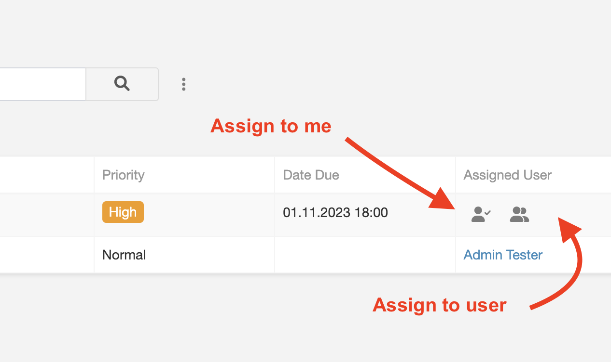

# Quick Assign 

> It is a tool that allows you to assign multiple record to a user in EspoCRM in one click.
> Quick Assign It is available in [Ebla Quick Assign](https://www.eblasoft.com.tr/espocrm-extension-page/quick-assign).

---

 

---

1. new action **Assign to User**.
2. new action **Assign to Me**.

 

## ChangeLog

