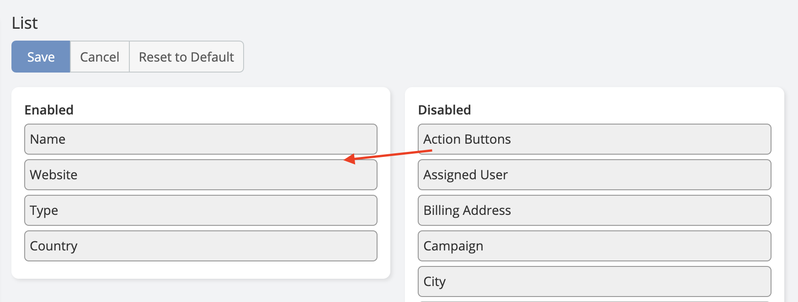
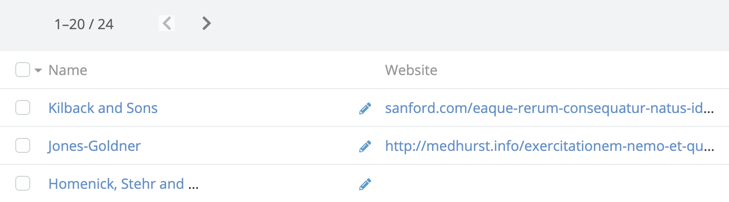
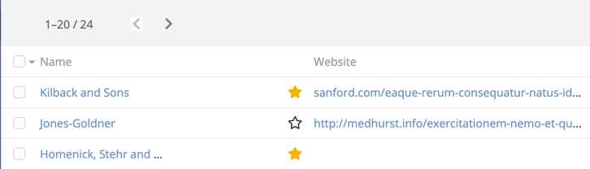

# Espocrm Quick List Icons 

## Overview

Ebla Quick List Icons is an extension for EspoCRM that enhances the list experience by introducing several new buttons
to the do quick action to records.

[See it on website](https://www.eblasoft.com.tr/espocrm-extension-page/espocrm-ebla-quick-list-icons){:target="_blank" .md-button }

---
<iframe width="650" height="315" src="https://www.youtube.com/embed/jKYGJKMZ8dQ" frameborder="0" allow="accelerometer; autoplay; clipboard-write; encrypted-media; gyroscope; picture-in-picture" allowfullscreen></iframe>

---

### Available Icons

- [View](#view-button)
- [Edit](#edit-button)
- [Delete](#delete-button)
- [Follow](#follow-button)
- [Stream](#stream-button)
- [Star](#star-button)

### Setup

- Go to Administration -> Entity Manager -> Select Entity -> Edit Entity
- From **List Action Buttons** field select the buttons you want to show in the list view and save.

- Go back and select Layouts.
- Add **Action Buttons** to the list or list small layout and save.

### View Button
When you click the view button, it will open the record detail modal.

### Edit Button
When you click the edit button, it will open the record edit modal.

### Delete Button
When you click the delete button, it will delete the record.

### Follow Button
follow icon that shows the following status.
When you click the follow icon, if the record is not followed, it will follow the record.
If the record is followed, it will unfollow the record.

### Stream Button
Showing the number of posts in the stream.
When you click the stream button, it will open the entity and scroll to the stream panel if exists.

### Star Button

Star icon that shows whether a record is starred (favorited).
When you click the star icon, if the record is not starred, it will mark it as starred.
If the record is already starred, it will unstar the record.

## ChangeLog

