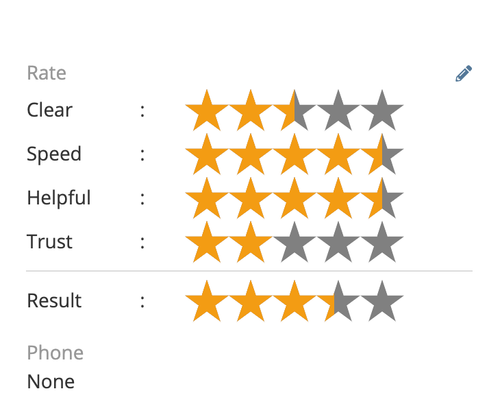
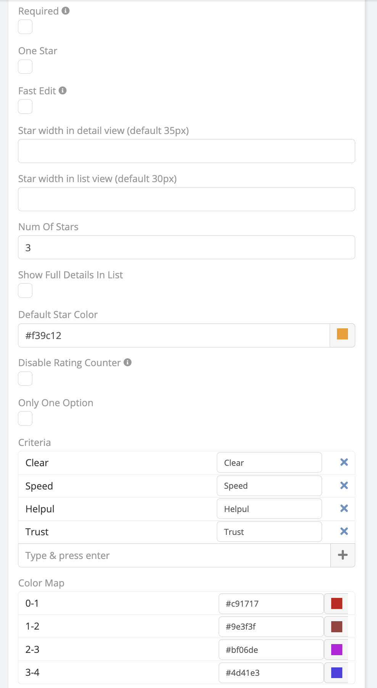

# Rate Star Field 

> Adding new field type **Rate Field**, to allow EspoCRM users easily seat and read rates,
> is available in [Ebla Rate](https://www.eblasoft.com.tr/espocrm-extension-page/espocrm-rate-field).

---

## Overview
The Ebla Rate extension adds a sophisticated rating field to EspoCRM, allowing users to rate records based on single or multiple criteria. It supports weighted averages, visual customization, and various display modes.

<iframe width="650" height="315" src="https://www.youtube.com/embed/INpxxBnxpWE" frameborder="0" allow="accelerometer; autoplay; clipboard-write; encrypted-media; gyroscope; picture-in-picture" allowfullscreen></iframe>

---

## Features
*   **Star Rating**: Interactive star rating interface.
*   **Multiple Criteria**: Define custom criteria (e.g., Quality, Service, Price) for granular ratings.
*   **Weighted Average**: Automatically calculates and displays the average rating across all criteria.
*   **Visual Customization**:
    *   Configurable star colors.
    *   Adjustable star widths for different views (List, Detail, Edit).
    *   Color mapping to change star colors based on score thresholds.
*   **Display Modes**:
    *   **Standard**: Shows all criteria and average.
    *   **One Option**: Simplified mode acting as a single rating value.
    *   **Read-Only One Star**: Compact display showing a single star icon in read mode.
*   **Inline Editing**: Support for fast inline editing in list and detail views.

## Configuration
After installation, you can configure the Rate field in the Entity Manager.

### Field Parameters
*   **Required**: Make the rating mandatory.
*   **Number of Stars**: Set the scale (default is 5, max 30).
*   **Criteria**: Add multiple rating criteria.
*   **Star Color**: Set the default color for stars.
*   **Color Map**: Define specific colors for different rating values (e.g., 1-2 stars: Red, 4-5 stars: Green).
*   **One Option**: Treat as a single value field instead of multi-criteria.
*   **Fast Edit**: Enable/Disable inline editing.
*   **Ignore Empty Criteria**: If checked, unrated criteria won't affect the average calculation.
*   **Disable Rating Counter**: Hide the numerical counter.

## Installation
1.  Navigate to **Administration > Extensions**.
2.  Upload the extension package.
3.  Install and rebuild the system.

## Usage
1.  Go to **Administration > Entity Manager**.
2.  Select the entity you want to add a rating to (e.g., Account, Contact).
3.  Create a new field of type **Rate**.
4.  Configure the criteria and display options.
5.  Add the field to your layouts.

---
*Copyright (c) Eblasoft Bilişim Ltd.*
