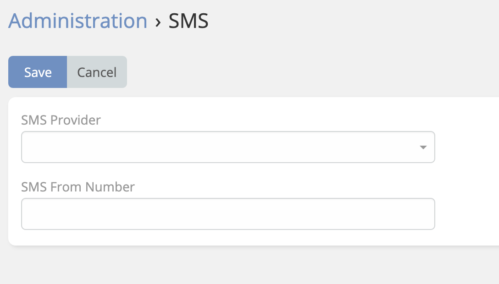

# Ebla SMS for EspoCRM 

## Overview
**Ebla SMS** is an extension for EspoCRM that allows users to send SMS messages from record detail and list views, manage SMS communications, and create SMS campaigns using various supported SMS gateways.

!!! note
    Read more about [EspoCRM SMS Sending](https://docs.espocrm.com/administration/sms-sending/).

## Features

### Enable SMS Entity
Ability to manage SMS entity within EspoCRM entity manager. Some projects may require customizations or additional relationships.

### Mass SMS Sending
Mass action on list views to send SMS messages to multiple records at once (Contacts, Leads, Accounts, etc.).

### SMS Templates
Same as Email Templates, you can create SMS templates to reuse them while sending messages.

### Add SMS in Activity Panel
Ability to send SMS in the Activity panel of records. Similar to calls and emails.

### View SMS messages in History panel

### Create Sms Button in SMS Entity
Enables a "Create Sms" button in the SMS list view to quickly send a new SMS to a specific number.

### Campaigns of type "Message"
Ability to create campaigns of type "Message" to send SMS messages to a target list And schedule jobs to send messages to target lists within SMS campaigns.

### Reply Button for Incoming Messages
A "Reply" button is available for incoming messages in the SMS entity, allowing users to respond directly from the SMS record view.

## Installation
1. **Administration -> Integration** – Configure your SMS provider by entering required credentials.
2. Go to **Administration -> SMS** – Select the SMS provider and specify the **From Number** if needed.

Supported SMS Providers:
> - Twilio
> - Spryng
> - sms77
> - smstools
> - SerwerSms
> - Verimor

## ChangeLog

