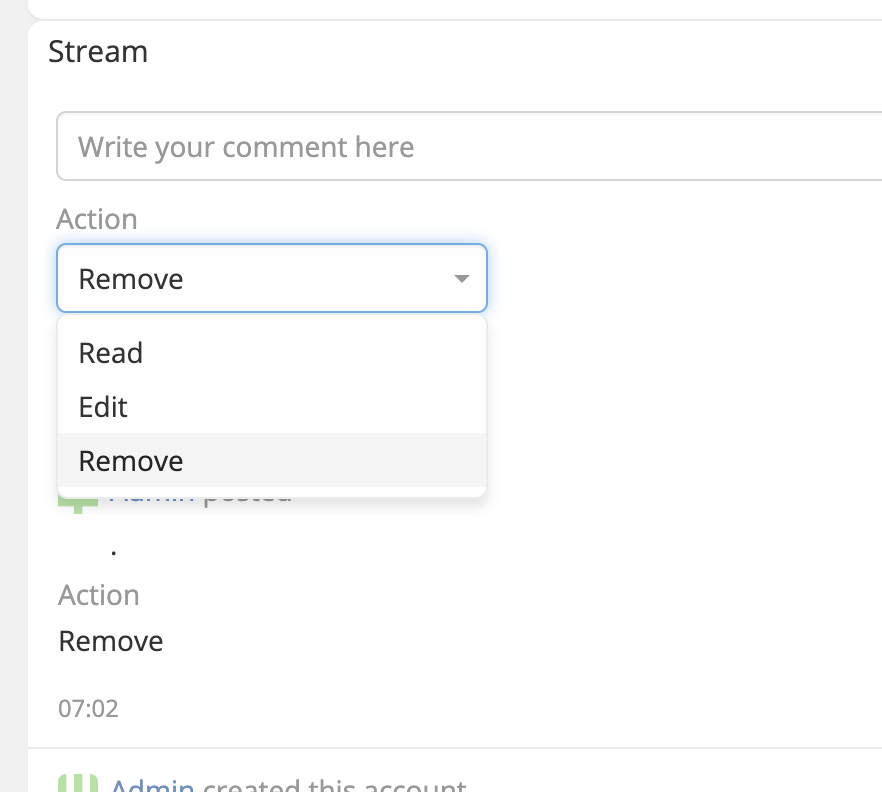
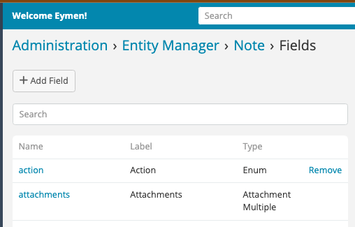

---
search:
  # Rank up the boost for this page
  boost: 2
---
# Stream Plus 

> Ability to define custom fields for stream from entity manager in EspoCRM is available
> in [Ebla Stream Plus](https://www.eblasoft.com.tr/espocrm-extension-page/stream-plus).
>

---

---
**-** Go to **Administration** -> **Entity Manager** -> **Note.**

!!! note

     Ability to create reports on Stream note entity using Advanced pack.

 

###  [ChangeLog](changelog.md) 