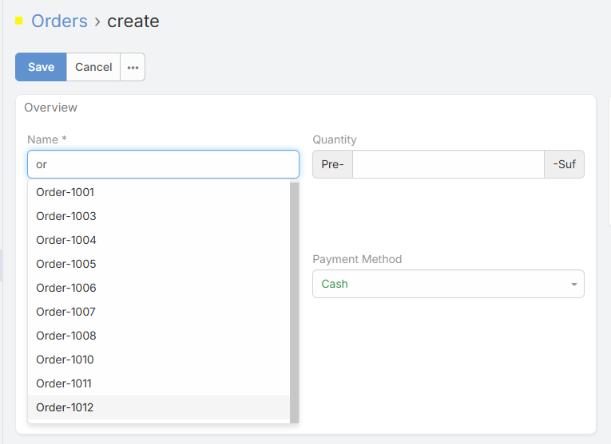
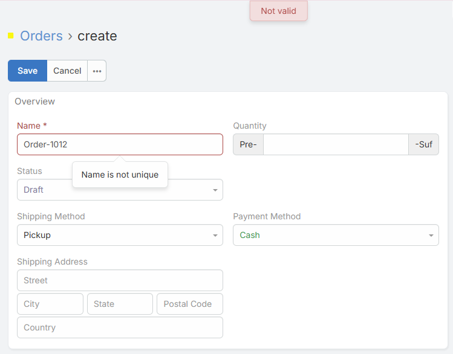
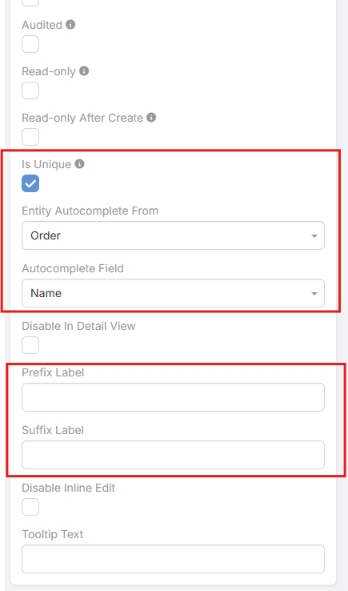

# Varchar Plus 

> Varchar Plus extends standard Varchar and Integer fields in EspoCRM with advanced options for unique values, cross-entity autocomplete, and custom display labels.

<iframe width="650" height="315" src="https://www.youtube.com/embed/YOUR_VIDEO_ID" frameborder="0" allow="accelerometer; autoplay; clipboard-write; encrypted-media; gyroscope; picture-in-picture" allowfullscreen></iframe>

---

## Overview
Varchar Plus provides a set of enhancements for text and numeric fields:

* Ensure data consistency with unique values.
* Speed up data entry via autocomplete from another entity.
* Improve clarity with prefix and suffix labels in edit mode.
* Can be applied to Varchar fields and numeric fields (Integer).

It is ideal for fields like product codes, customer references, order identifiers, or any free-text or numeric fields where accuracy and quick entry are important.

---

## Features
* **isUniq** – Prevents duplicate values across records.
* **Entity Autocomplete From** – Choose an entity to fetch autocomplete values.
* **Autocomplete Field** – Specify which field in the selected entity to use for suggestions.
* **Prefix Label** – Display a text before the field value in edit mode without saving it.
* **Suffix Label** – Display a text after the field value in edit mode without saving it.
* **Integer Support** – Prefix and suffix labels can be applied to Integer fields as well.
* **Dynamic Autocomplete** – Autocomplete suggestions are always up-to-date from the chosen entity.
* **Flexible Integration** – Can be added to any entity: Accounts, Contacts, Leads, Opportunities, Products, Orders, or custom entities.

---

## Configuration
Configure Varchar Plus options via the Entity Manager:

* **isUniq**: Enable to prevent duplicate entries.
* **Entity Autocomplete From**: Select the entity for fetching values.
* **Autocomplete Field**: Choose the field in that entity for suggestions.
* **Prefix Label**: Enter text to show before the value in edit mode.
* **Suffix Label**: Enter text to show after the value in edit mode.
* **Integer Support**: Apply Prefix/Suffix to numeric fields if needed.

---

## Usage
1. Open **Administration > Entity Manager**.
2. Select the target entity.
3. Create or edit a Varchar or Integer field.
4. Configure Varchar Plus options (isUniq, Autocomplete, Prefix/Suffix).
5. Add the field to your layouts (Edit, Detail, List).

---

*Copyright (c) Eblasoft Bilişim Ltd.*
