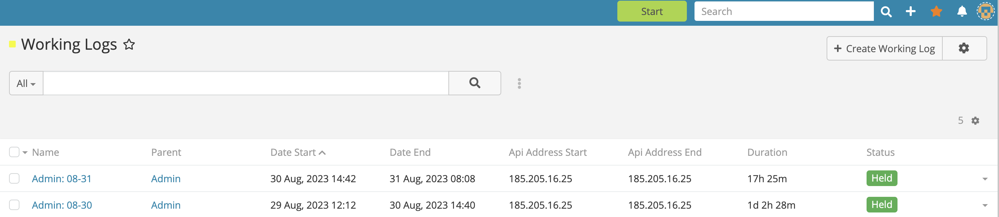

# Ebla Work Log 

## Overview

**Ebla Work Log** turns the EspoCRM navigation bar into a real-time control hub for work tracking and user availability. Team members can update their online status, review active timers, and open their work log board without leaving the page.

Once configured, the extension adds start/pause/stop actions to selected entities, records precise time intervals, captures IP addresses, and raises alerts when work extends beyond scheduled hours—giving managers trustworthy insight into where effort is spent.

<iframe width="650" height="315" src="https://www.youtube.com/embed/kg95tBnObAI" frameborder="0" allow="accelerometer; autoplay; clipboard-write; encrypted-media; gyroscope; picture-in-picture" allowfullscreen></iframe>

---

<!-- DOC:FEATURES START -->

## Key Features

- **Navbar Work Timer**: Shows a live HH:MM:SS counter in the top bar and opens the work log control panel with one click.
- **Open Work Logs Panel**: Displays the user’s active and paused logs in a dropdown with quick links plus start, pause, and stop actions.
- **Record Header Actions**: Adds Start, Pause, and Stop controls to chosen record headers while respecting access rules.
- **Automatic Interval Tracking**: Pauses any other in-progress logs, accumulates time intervals, and stores start/finish IP addresses for audit trails.
- **Online Status Toggle**: Maps a color-coded button to any boolean User field, enabling instant online/offline updates and related list filters.
- **Working Time Safeguards**: Includes a scheduled job that warns when logs continue outside assigned working-time calendars.

<!-- DOC:FEATURES END -->

---

<!-- DOC:USE-CASES START -->

## Use Cases

1. **Billable project tracking**: Capture effort on Cases, Tasks, or custom entities for downstream billing or cost allocation.
2. **Shift handover checks**: Confirm that agents clock in and out at the start and end of their working day.
3. **Remote team visibility**: Monitor who is online and what they are working on without requiring manual status reports.
4. **Service desk oversight**: Quickly spot stalled or paused work logs to keep ticket queues moving.
5. **Compliance audits**: Maintain verifiable start/end timestamps and IP logs for regulatory or contractual reporting.

<!-- DOC:USE-CASES END -->

---

<!-- DOC:CONFIGURATION START -->

## Configuration

Open **Administration → Settings → Work Log Configuration** to switch features on or off:

1. Pick the boolean User field that represents online availability, then choose the colors that indicate online and offline states.
2. Enable the navigation timer so the stopwatch button and dropdown appear in the navbar.
3. Mark the entity types that should expose work log controls; the system clears cache automatically after you save.

!!! tip
    Grant the **WorkingLog** scope to the teams that need access. Users require create permission to start logs and read permission to see the navbar panel.

<!-- DOC:CONFIGURATION END -->

---

<!-- DOC:USAGE START -->

## Usage

### Online availability toggle

1. Create the boolean User field that represents online status:
   - Open **Administration → Entity Manager → User → Fields → Add Field**.
   - Select **Boolean**, name it (for example *Online*), and save.

   

   

2. In Work Log settings, assign that field to the availability toggle and choose the colours that mark online and offline.
3. Users click the navbar button to switch between states; the label and colour update immediately to show availability.

### Navbar work timer

1. Enable the navigation timer in Work Log settings so the stopwatch button appears.
2. The button counts elapsed time in real time. Clicking it opens the My Open Work Logs panel without leaving the current page.

   

   

3. Use the panel to view your active logs, open parent records in a new tab, or pause/stop entries directly.

### Record-level tracking

1. Open a supported entity (Case, Opportunity, Task, or any custom type you enabled).
2. Start the timer from the record header; if another log is already running it pauses automatically.
3. Use **Pause** to hold the work without closing it, or **Stop** to finish and capture the end time.

### Monitoring team activity

1. Managers open the **WorkingLog** section from the main menu to filter by owner, status, or date.
2. The My Open Work Logs filter highlights items still in progress, while Today’s shows fresh entries.
3. Each User page includes a Work Logs panel so supervisors can review individual timelines.

<!-- DOC:USAGE END -->

---

<!-- DOC:ADVANCED START -->

## Advanced Features

### Working time validation
- A scheduled job named **Validate Working Time** ships with the extension and runs weekly by default.
- Adjust its schedule under **Administration → Scheduled Jobs** if you want more frequent checks.
- When active, the job posts a note on any timer that continues outside the user’s working-time calendar so supervisors can follow up.

<!-- DOC:ADVANCED END -->

---

<!-- DOC:SECURITY START -->

## Security & Permissions

- Respects EspoCRM ACL: users need WorkingLog create rights to start timers and read rights to view the navbar panel.
- Team assignments cascade to work logs, so managers only see records matching their scope.
- Online/offline toggles update the selected User field while observing field-level permissions.
- IP address capture provides an audit trail for start and end events; restrict delete access to administrators.

<!-- DOC:SECURITY END -->

---

<!-- DOC:CHANGELOG START -->

## Changelog

<!-- DOC:CHANGELOG END -->

---

<!-- DOC:SUPPORT START -->

## Support and Feedback

- Open a ticket via the [Eblasoft support portal](https://portal.eblasoft.com.tr) with your license details.
- Email the support team for configuration questions or troubleshooting help.
- Share feature requests from within your customer account to influence the roadmap.

<!-- DOC:SUPPORT END -->
