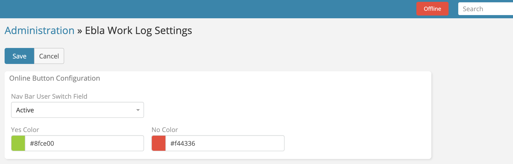

# Online / Offline

> Modify user status in EspoCRM to online/offline.
> in [Ebla Work Log](https://www.eblasoft.com.tr/espocrm-extension-page/espocrm-ebla-worklog).

---

---

1. Go to **Administration** -> **Entity Manager** -> **User** -> **Fields**.
2. Create field type **Boolean**.
3. select field type **Boolean**.

