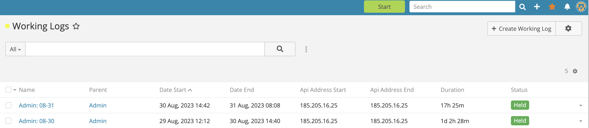
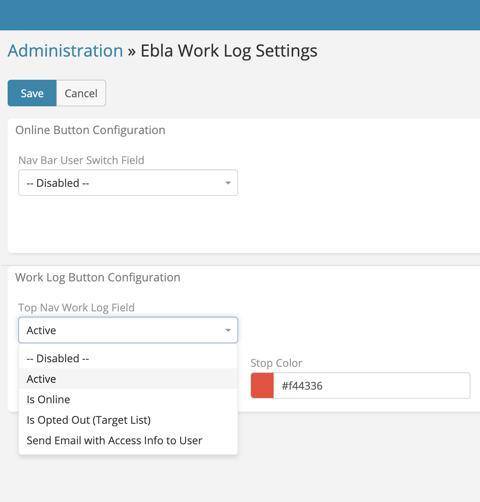

# Work Log Button

> Recording the user's daily working hours in EspoCRM is available
> in [Ebla Work Log](https://www.eblasoft.com.tr/espocrm-extension-page/espocrm-ebla-worklog).

---

---

1. Go to **Administration** -> **Entity Manager** -> **User** -> **Fields**.
2. Create field type **Boolean**.
3. select field type **Boolean**.

