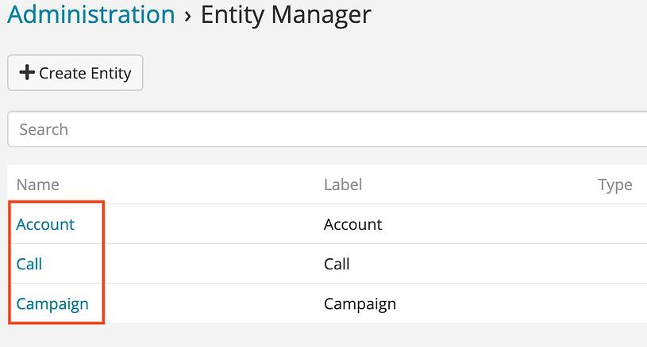

# Hide system scopes from admin UI

> Hide system scopes from admin UI in EspoCRM is available in [Ebla Admin Pro](https://www.eblasoft.com.tr/espocrm-extension-page/espocrm-admin-pro).

---

---

1- go to **Administration > Admin Pro settings** .

