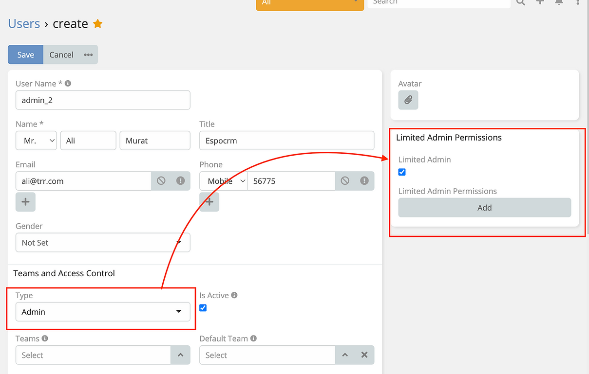

# Limit Admin User Permissions

> Available in [Ebla Admin Pro](https://www.eblasoft.com.tr/espocrm-extension-page/espocrm-admin-pro).

---

1- go to **Administration > Users > {user} > Edit**. (**User must be admin**)

