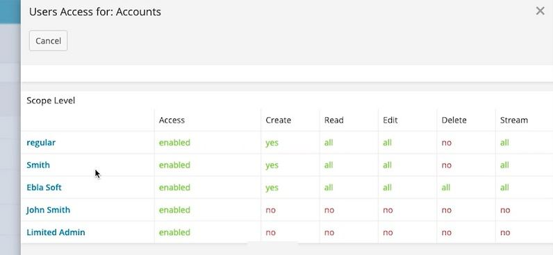
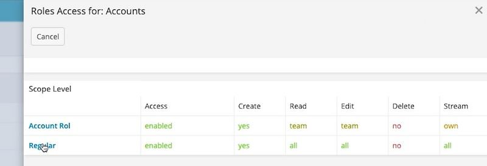
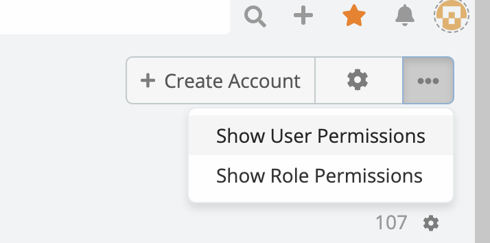

# Show Permissions For Specific User

> show permissions for specific (**user role**) is available
> in [Ebla Admin Pro](https://www.eblasoft.com.tr/espocrm-extension-page/espocrm-admin-pro).

---

1- show permissions for Users .

2- show permissions for Roles .

