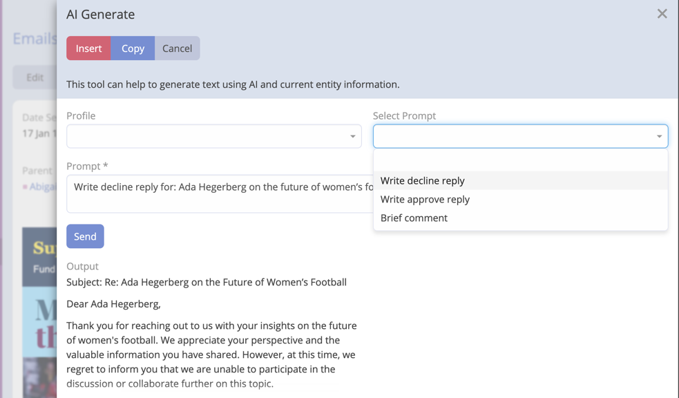
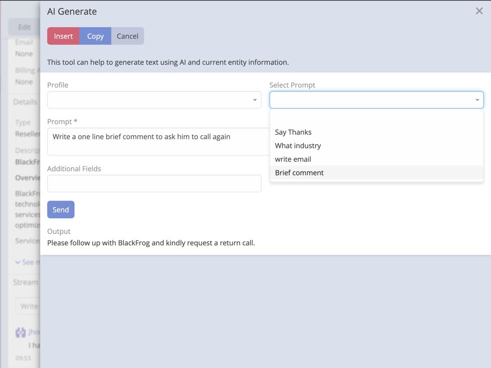
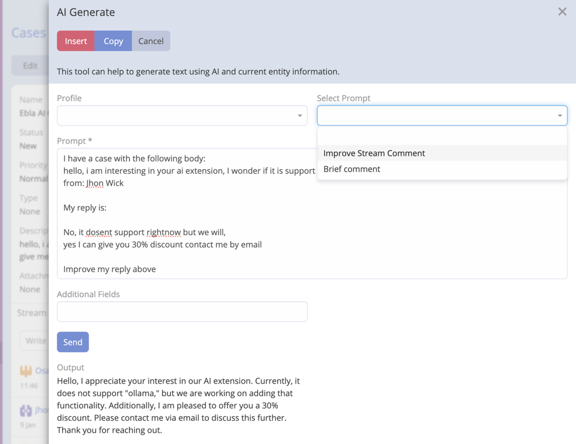

# AI Prompts

AI Prompts is a feature of Ebla AI that allows users to create and manage AI prompts. AI prompts are used as templates
of prompts.

## Creating an AI Prompt

1. Navigate to **Administration** -> **AI Prompts**.
2. Click **Create**.
3. Enter a name for the AI prompt.
4. Select Entity Type.
5. Enter the prompt context.

!!! important

    If output is not as expected, you can click on **Send** button to regenerate the output.

## Examples

### Example 1: Email Reply

```
Write decline reply for: {{name}}
```

```
Write approve reply for: {{name}}
```



### Example 2: Stream Comment

```
Write a one line brief comment to ADD_COMMENT_HERE
```



### Example 3: Improve Stream Comment for Case entity

```
I have a case with the following body:
{{{description}}}

My reply is:

MY_REPLAY

Improve my reply above
```

