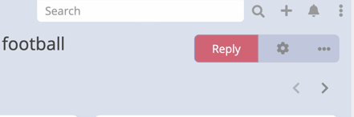
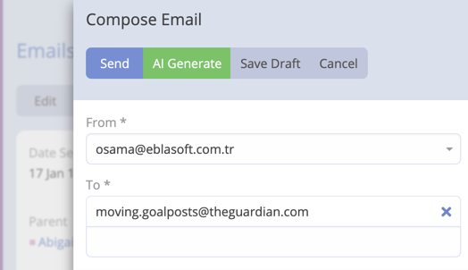
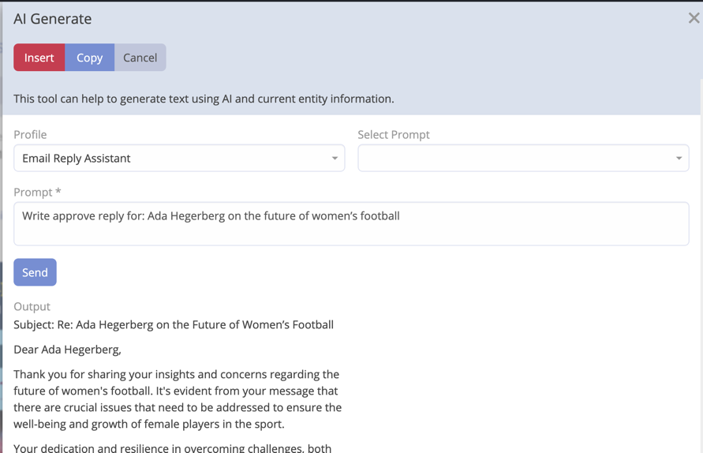

# Email Reply

By using this feature you can generate and refine a proper email reply. The AI will generate a reply based on the context and the prompt you provide.

## Creating an Email Reply

1. Navigate to the Email you want to reply to it.
2. Click **Reply**.

    
3. Click **AI Generate**.
    
    
4. Select Profile "Email Reply Assistant".
5. Enter the prompt context or select it from predefined prompts.

    
6. Click **Send**.
7. The AI will generate a reply based on the context and the prompt you provided. 
   - You can Press **Insert** to insert the generated reply into the email body.
   - You can Press **Copy** to copy the generated reply to the clipboard.

!!! important

    If output is not as expected, you can click on **Send** button to regenerate the output.