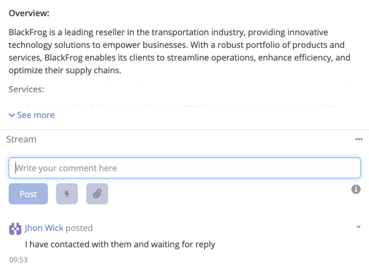

# Stream Comment Reply

By using this feature you can generate and refine a proper comment for the stream. The AI will generate a comment based
on the previous comments and the prompt you provide.

## Creating a Stream Comment Reply

1. Navigate to the Record you want to comment on it.
2. Click on Stream section on **Write your comment here**.
3. Press on the bolt icon button.

   

4. Select Profile. (Optional)
5. Enter the prompt context or select it from predefined prompts.
6. Click **Send**.
7. If output is good, you can click on **Insert** to add the comment.

!!! important

    If output is not as expected, you can click on **Send** button to regenerate the output.