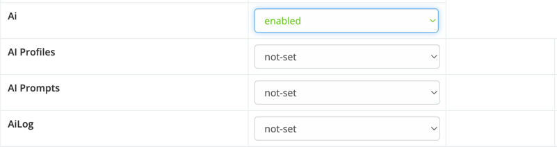

# Overview 

> Ebla AI is an advanced module for EspoCRM that harnesses the power of artificial intelligence to enhance user
> productivity and streamline workflows. With features like email message generation, lead scoring, and custom formula
> functions, Ebla AI offers a comprehensive suite of tools to optimize CRM operations.

 

<iframe width="750" height="350" src="https://www.youtube.com/embed/" frameborder="0" allow="accelerometer; autoplay; clipboard-write; encrypted-media; gyroscope; picture-in-picture" allowfullscreen></iframe>

 

---

#### Providers Setup

- [OpenAI](providers/openai-setup.md)
- [Gemini](providers/gemini-setup.md)

### Features

- [AI Profiles](features/ai-profiles.md)
- [AI Prompts](features/ai-prompts.md)
- [Email Reply](features/email-reply.md)
- [Stream Comment](features/stream-comment.md)
- [Formula](features/formula.md)
- [Sandbox](features/sandbox.md)

 

## Access control

**Important**: By default, regular and portal users don’t have access to AI features. Administrator needs to enable access
in Roles.

!!! warning

    AI Sandbox feature is only available for Admin users

###  [ChangeLog](changelog.md) 