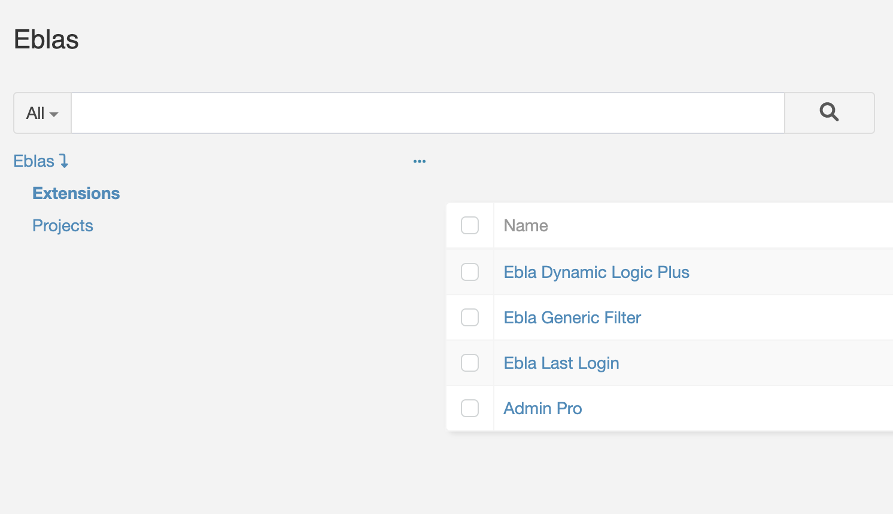
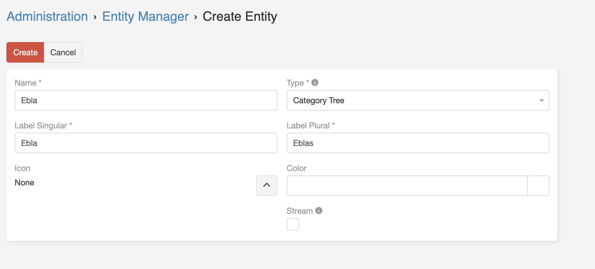

# Category Tree

> **Category Tree** is a new template entity that allows you to create a tree of categories and subcategories.
> It is a very useful entity for creating a tree of categories and subcategories for any entity in the system.
> Is available in [Ebla Category Tree](https://www.eblasoft.com.tr/espocrm-extension-page/category-tree).

---

---

1. Go to **Administration** -> **Entity Manager** -> **Create Entity** -> **Category Tree**.

 

** [Changelog](changelog.md) **