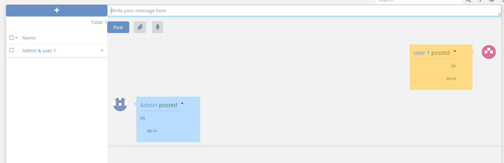

# Ebla Chat  

> Ebla Chat for dialog with users in internal system is available
> in [Ebla Chat](https://www.eblasoft.com.tr/espocrm-extension-page/espocrm-chat).

---

<iframe width="560" height="315" src="https://www.youtube.com/embed/1gKOLniE9Xg?si=LgmgPSszstREs6jr" title="YouTube video player" frameborder="0" allow="accelerometer; autoplay; clipboard-write; encrypted-media; gyroscope; picture-in-picture; web-share" allowfullscreen></iframe>

---

---

go to **Roles** -> enable access to **Dialog**  .

 

###  [ChangeLog](changelog.md) 

