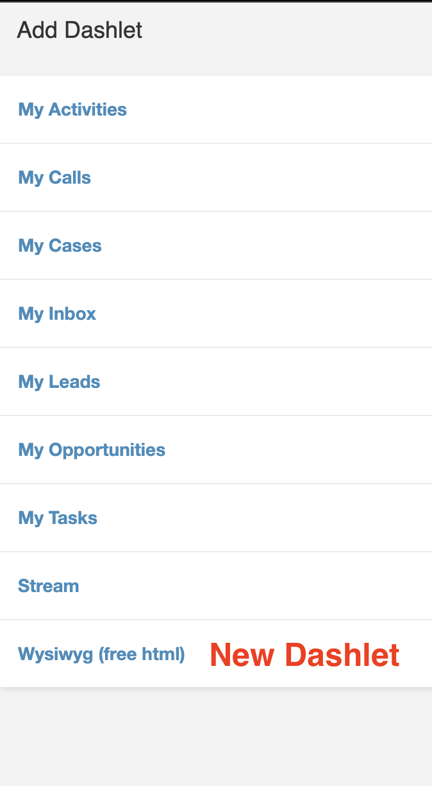

# Dash Pro 

> It is a new Dashlet in EspoCRM **Wysiwyg  (free html)**
> Dash Pro is available in [Ebla Dash Pro](https://www.eblasoft.com.tr/espocrm-extension-page/dash-pro).

---

 

 

** [Changelog](changelog.md) **

