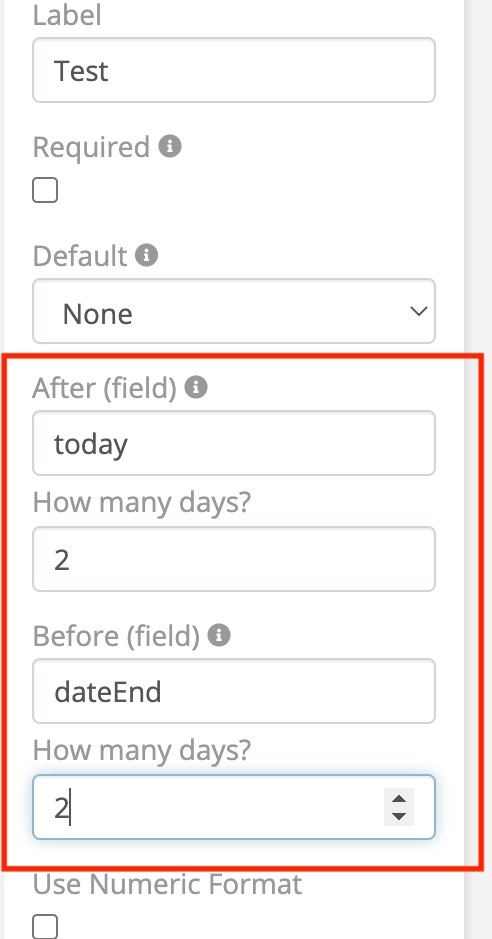

# Date Pro

> adding new field type **Date-Time with Timezone** Display the time according to the selected time zone, is available
> in [Ebla Date Pro](https://www.eblasoft.com.tr/espocrm-extension-page/espocrm-date-pro-field).

---

---

1. go to **Admin** -> **Entity Manager** -> **{Entity Type}** -> **Fields** -> **Add Field** -> **Date-Time with
   Timezone**.

** [Changelog](changelog.md) **