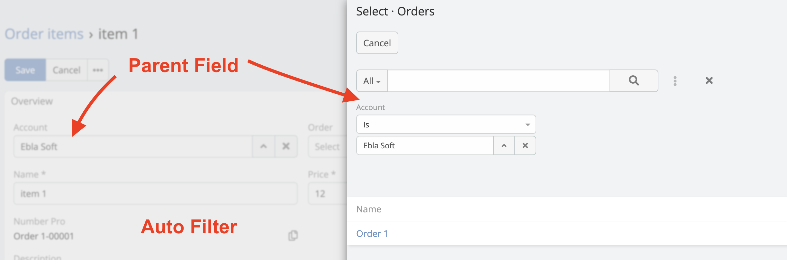
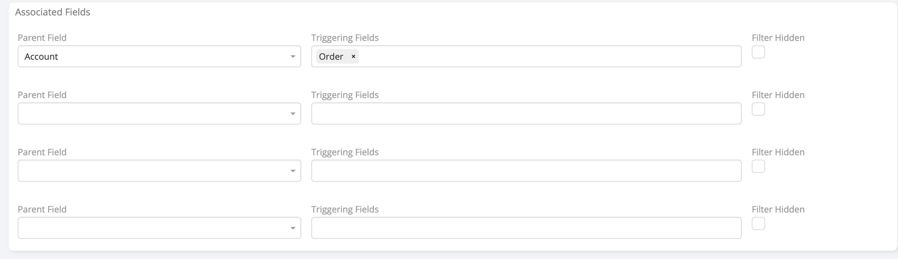

> Auto Filter When Parent or child links is Selected in EspoCRM is available
> in [Ebla Dynamic Logic Plus](https://www.eblasoft.com.tr/espocrm-extension-page/dynamic-logic-plus).

---

1. Go to **Administration** -> **Entity Manager** -> **{Entity Type}** -> **Fields Operations**.

 

** [Changelog](changelog.md) **