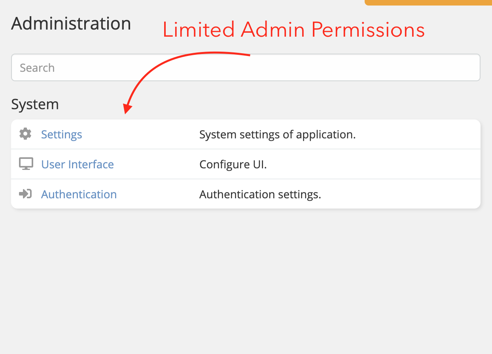

# Espocrm Ebla Admin Pro

---

<ins class= "font1" > Version:</ins> 1.0.0
<ins class= "font1" > Supported EspoCRM Versions:</ins> >=5.6.2
<ins class= "font1" > Type:</ins> paid

## Overview
> Admin Pro Settings.

## Features

1. **[Limited admin:](/extensions/ebla-admin-pro/espocrm-ebla-admin-pro-features.md?id=limited-admin)**  limited the admin user to specific administration functions.

2. **[Disable unused entities:](/extensions/ebla-admin-pro/espocrm-ebla-admin-pro-features.md?id=disable-unused-entities)** - disable unused entities so will not show anywhere.

3. **[Show/hide system scopes:](/extensions/ebla-admin-pro/espocrm-ebla-admin-pro-features.md?id=show/hide-system-Scopes)** - Show/hide System Scopes.

4. **[Show user permissions:](/extensions/ebla-admin-pro/espocrm-ebla-admin-pro-features.md?id=show-user-permissions)** - Show User Permissions.

5. **[Show role permissions:](/extensions/ebla-admin-pro/espocrm-ebla-admin-pro-features.md?id=show-role-permissions)** - Show Role Permissions.

## How to Install

You can install this extension following the steps in [EspoCRM Documentation](https://docs.espocrm.com/administration/extensions/).

---

