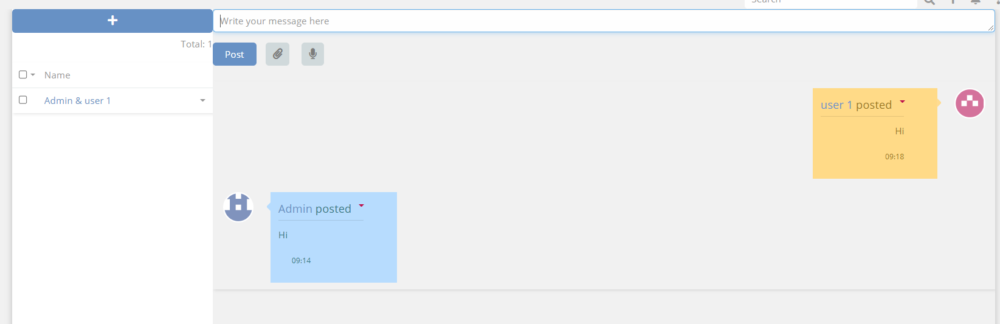
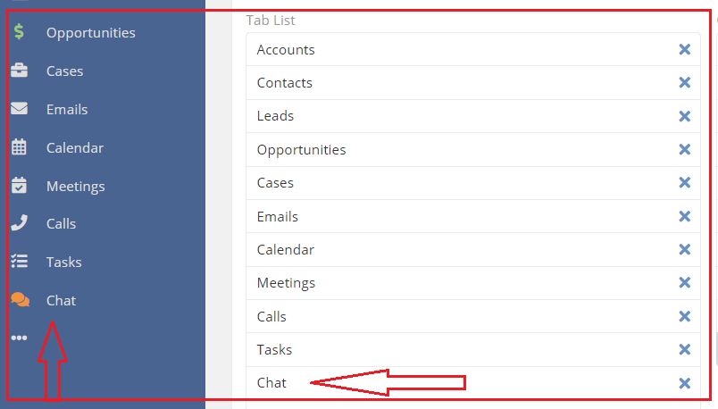
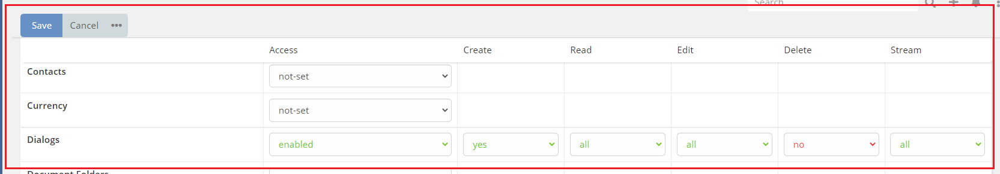
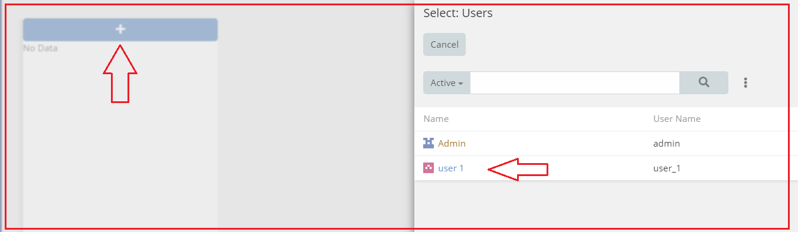
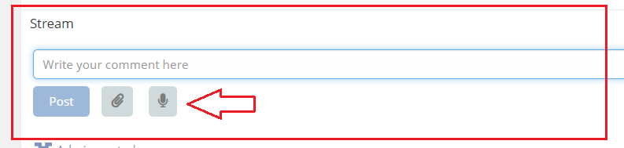

# Ebla Chat .

### This is to facilitate the process of communication among the company's employees within the company's system without the need for external programs.

[//]: # (change id-video )
[//]: # (<iframe width="650" height="315" src="https://www.youtube.com/embed/id-video" frameborder="0" allow="accelerometer; autoplay; clipboard-write; encrypted-media; gyroscope; picture-in-picture" allowfullscreen></iframe>)

### the features of the chat

#### Text messaging: Users can send and receive text messages.

#### Media sharing: Users can share photos, videos, and other types of media with users in system.

#### Voice messaging is a feature on Ebla Chat that allows users to record and send voice messages to users in system.

#### These are some basic features of Ebla Chat, but new features and updates are released regularly to improve the user experience and provide new functionalities.

### Setting up

after installing the extension,

1. go to **UserInterFace** -> add to **Tab List** .

##

2. go to **Roles** -> enable access to **Dialog**  .

##

3. go to **Chat** -> Select a user to initiate a conversation with them. .
   

###  Enhancing the Stream with additional benefits.
