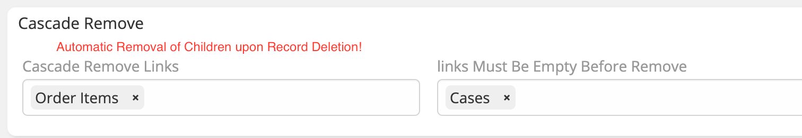

> Links must be empty before remove parent record in EspoCRM.
> is available in [Ebla Dynamic Logic Plus](https://www.eblasoft.com.tr/espocrm-extension-page/dynamic-logic-plus).

---

1. Go to **Administration** -> **Entity Manager** -> **{Entity Type}** -> **Fields Operations**.
2. Select the **links Must Be Empty Before Remove**.

 

** [Changelog](changelog.md) **