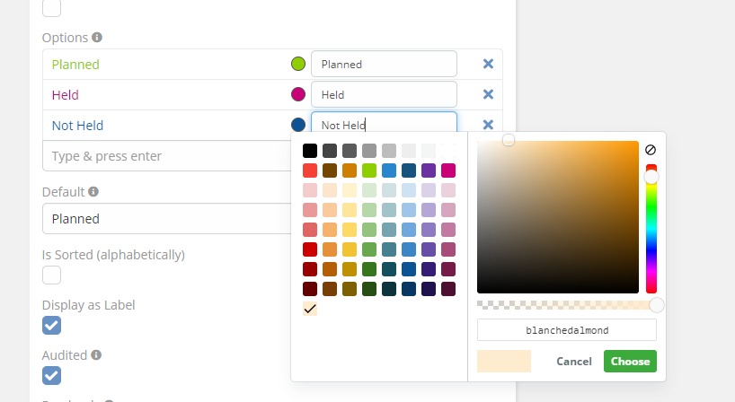
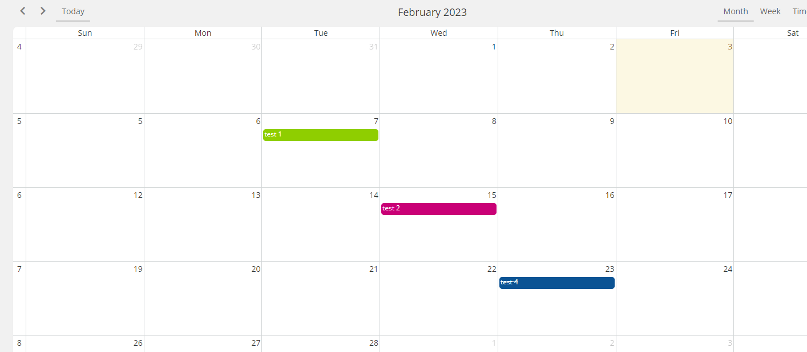

# [Ebla Enum Color.](../setting-up.md) Calendar

**This feature enables you to add colors to calendar .**

## How to use it

1. go to **Admin** -> **Entity Manager** -> **Scope** -> **Fields** -> **Add Field** -> **Enum Type** .

**and select color option.**

2. Enable **Display as Label** option.

## Result:
